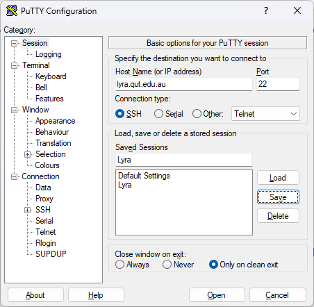
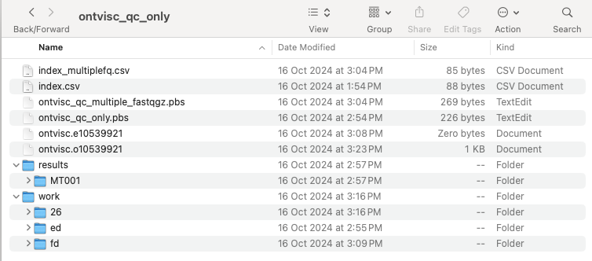
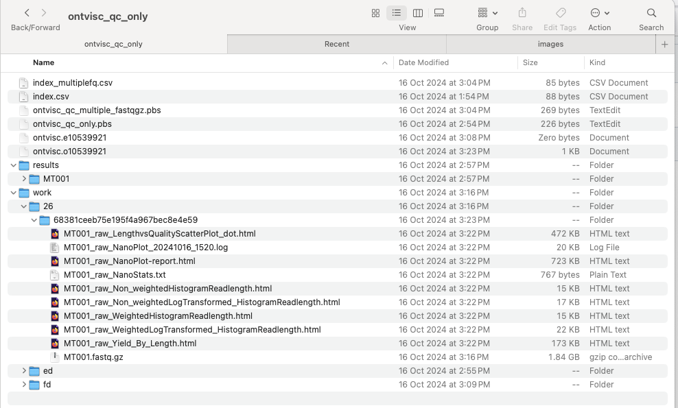
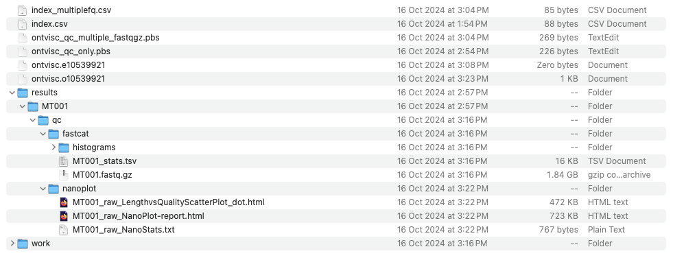
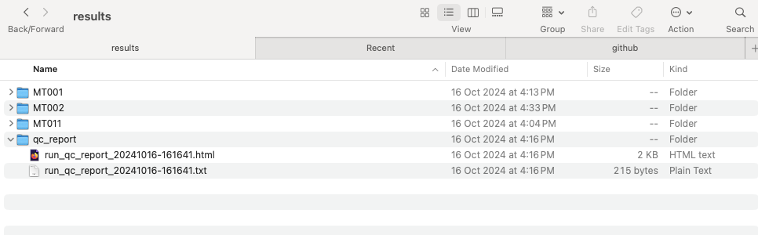
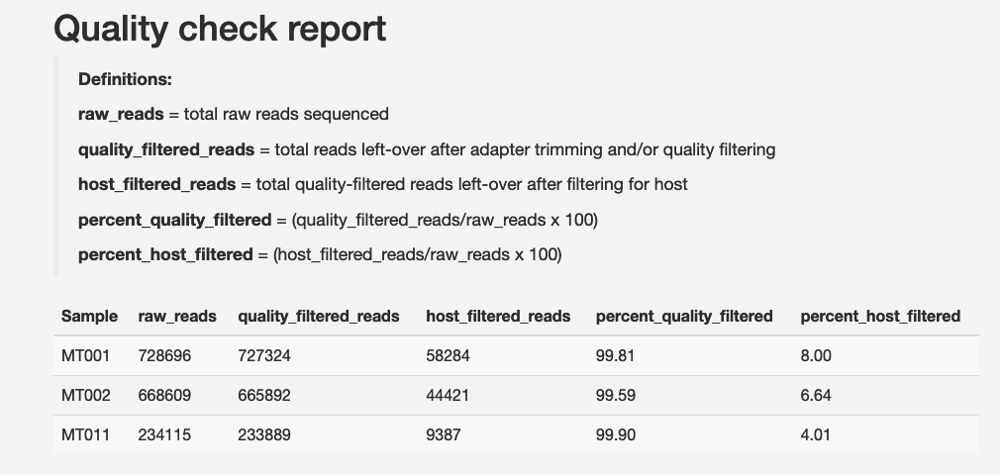
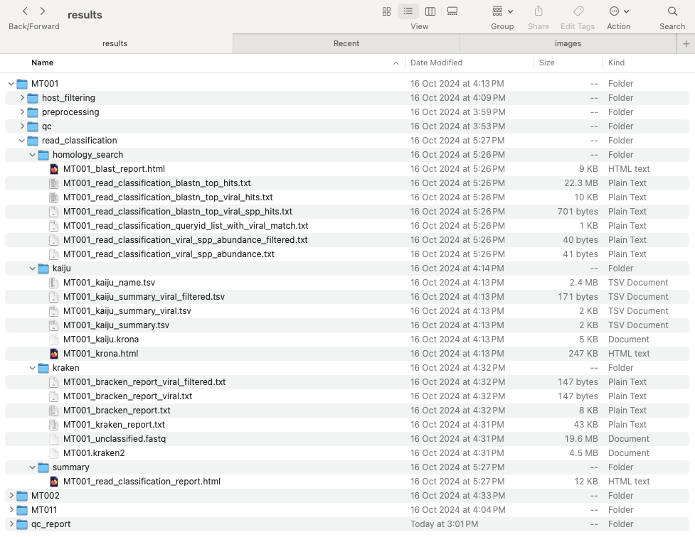
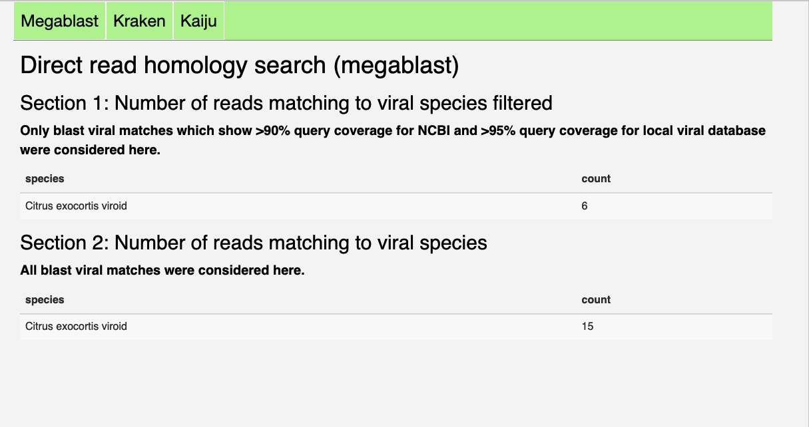

# ONTViSc-hands-on-training
**Friday 1st November 2024 10-12 am**  
**In person workshop for DAFF staff**  
**QUT Garden Point P block level 8 room 810**  

## Aims of this workshop
- Learn how to install and run ONTViSc with test data on the HPC Lyra
- Run and review QC
- Run the 4 different modes
- If time permits test with datasets from participants

## What is Oxford Nanopore data?
Using long nanopore DNA/RNA sequencing reads researchers can:
- Resolve complex structural variants and repetitive regions
- Simplify de novo genome assembly and improve existing reference genomes
- Study linkage and phasing
- Enhance metagenomic identification of closely related species and distinguish plasmid from genome
- Sequence entire microbes in single reads – in real-time
- Explore epigenetic modifications using direct, long-read DNA sequencing

## How does it work?
Nanopore sequencing is a unique, scalable technology that enables direct, real-time analysis of long DNA or RNA fragments. It works by monitoring changes to an electrical current as nucleic acids are passed through a protein nanopore. The resulting signal is decoded to provide the specific DNA or RNA sequence.  
A range of nanopore sequencing devices are available, providing high-yields and scalable sample throughput to suit all requirements — from portable analysis using Flongle and MinION, through to flexible, high-throughput benchtop sequencing on GridION and PromethION. MinION Starter Packs are available from just $1,000 providing low-cost access to the benefits of long-read, real-time DNA sequencing.  
Unlike traditional DNA sequencing platforms, which deliver data in bulk at the end of a sequencing run, nanopore DNA sequencing data is streamed in real time — providing immediate access to results. Advantages of real-time data streaming include rapid access to time critical information (e.g. pathogen identification), the generation of early sample insights, and the facility to stop sequencing once a result has been achieved — enabling washing and reuse of the flow cell.

Nanopore technology can be applied across all DNA sequencing techniques.
- Whole genome sequencing: Accurately characterise all genomic variants and generate complete genome assemblies.
- Targeted sequencing: Sequence long targeted regions and expand on the limitations of traditional targeted sequencing approaches. Use amplification-free strategies to preserve base modifications.
- Metagenomic sequencing: More accurately identify microbes and their abundance with real-time results.
- Epigenetics: dentify base modifications alongside DNA sequence using direct sequencing approaches.

## ONTViSc
eresearchqut/ontvisc is a Nextflow-based bioinformatics pipeline designed to help diagnostics of viruses and viroid pathogens for biosecurity. It takes fastq.gz files generated from either amplicon or whole-genome sequencing using Oxford Nanopore Technologies as input.  

The pipeline can either: 1) perform a direct search on the sequenced reads, 2) generate clusters, 3) assemble the reads to generate longer contigs or 4) directly map reads to a known reference.  

The reads can optionally be filtered from a plant host before performing downstream analysis.  

The ONTViSc pipeline is written in Nextflow.  

## Requirements

To be able to run the exercises today, you’ll need:
- A HPC account
- PuTTy installed on your local computer
- Access your HPC home directory from your PC

Instructions for getting a HPC account are here: https://qutvirtual4.qut.edu.au/group/staff/research/conducting/facilities/advanced-research-computing-storage/supercomputing/getting-started-with-hpc

You’ll need PuTTY on your PC to access the HPC.

You can download PuTTY from here: https://the.earth.li/~sgtatham/putty/latest/w64/putty.exe

Then add the HPC (Lyra) address: lyra.qut.edu.au and then click ‘open’.
<p align="left"></p>

Setup Windows File Explorer to access your HPC home account. Follow the instructions here:

https://qutvirtual4.qut.edu.au/group/staff/research/conducting/facilities/advanced-research-computing-storage/supercomputing/using-hpc-filesystems

If you want to familiarise yourself with Nextflow, please review the material covered in the workshop [Introduction to Nextflow](https://eresearchqut.atlassian.net/wiki/spaces/EG/pages/2261090311/2024-S2+eResearch+-+Session+3+Introduction+to+Nextflow)
A generic [user guide](https://mantczakaus.github.io/ontvisc_guide) on how to set up and execute OntViSc is also available. It covers how to run Nextflow from tower, which will not be covered in this workshop.
Nextflow can be used on any POSIX compatible system (Linux, OS X, etc). It requires Bash 3.2 (or later) and Java 11 (or later, up to 21) to be installed.

## Installing Nextflow
1. Log in to Lyra ```ssh [username]@lyra.qut.edu.au```
2. Start an interactive session: ```qsub -I -S /bin/bash -l walltime=10:00:00 -l select=1:ncpus=1:mem=4gb```
3. Load java: ```module load java```
4. If you haven't done so before, install [Nextflow](https://www.nextflow.io/docs/latest/getstarted.html#installation)
    - Download the executable package by copying and pasting either one of the following commands in your terminal window: ```curl -s https://get.nextflow.io | bash```
     This will create the nextflow main executable file in the current directory.
    - Make the binary executable on your system by running chmod +x nextflow. Optionally, move the nextflow file to a directory accessible by your $PATH variable (this is only required to avoid remembering and typing the full path to nextflow each time you need to run it): ```mv nextflow $HOME/bin```
PLease note: If you have installed Nextflow before on the HPC then you will have to run: ```nextflow self-update```
5. Once you have installed Nextflow on Lyra, there are some settings that should be applied to your $HOME/.nextflow/config to take advantage of the HPC environment at QUT.
To create a suitable config file for use on the QUT HPC, copy and paste the following text into your Linux command line and hit ‘enter’. This will make the necessary changes to your local account so that Nextflow can run correctly:
6. You will also need [Singularity](https://docs.sylabs.io/guides/3.0/user-guide/quick_start.html#quick-installation-steps) for Nextflwo to run. It is already installed on Lyra. But make sure it is installed on your machine if you run the pipeline locally on your own machine.

## Set up your nextflow config file

A key Nextflow feature is the ability to decouple the workflow implementation, which describes the flow of data and operations to perform on that data, from the configuration settings required by the underlying execution platform. 

This enables the workflow to be portable, allowing it to run on different computational platforms such as an institutional HPC or cloud infrastructure, without needing to modify the workflow implementation.

For instance, a user can configure Nextflow so it runs the pipelines locally (i.e. on the computer where Nextflow is launched), which can be useful for developing and testing a pipeline script on your computer. This is the default setting in Nextflow. **This is also how you will running ONtViSc if you using a local machine.**

```
process {
  executor = 'local'
}
```
You can also configure Nextflow to run on a cluster such as a PBS Pro resource manage, which is the setting we will use on the HPC:
```
process {
  executor = 'pbspro'
}
```

The base configuration that is applied to every Nextflow workflow you run is located in $HOME/.nextflow/config.

To take advantage of the HPC environment at QUT, once you have installed Nextflow on Lyra, we will use the **pbspro** executor. To create a suitable config file for use on the QUT HPC, copy and paste the following text into your Linux command line and hit ‘enter’. This will make the necessary changes to your local account so that Nextflow can run correctly:
```
[[ -d $HOME/.nextflow ]] || mkdir -p $HOME/.nextflow

cat <<EOF > $HOME/.nextflow/config
singularity {
    cacheDir = '$HOME/.nextflow/NXF_SINGULARITY_CACHEDIR'
    autoMounts = true
}
conda {
    cacheDir = '$HOME/.nextflow/NXF_CONDA_CACHEDIR'
}
process {
  executor = 'pbspro'
  scratch = false
  cleanup = false
}
EOF
```

## Install ontvisc for the first time
To install ontvisc, run the following command:
```
nextflow run eresearchqut/ontvisc -profile test,singularity
```
The first time the command runs, it will download the pipeline into your assets folder located under ~/.nextflow/assets

The source code can also be downloaded directly from GitHub using the git command:
```
git clone https://github.com/eresearchqut/ontvisc.git
```

### Location of test data: ###
The test data that we will use today can be found under /work/training/ontvisc_handson_training.


## Installing the required indexes and references
Depending on the pipeline analysis mode you are interested to run, you will need to install some databases and references.

| Mode | Index | Description |
| --- | --- | --- |
| --host_filtering | --host_fasta | path to host fasta file to use for read filtering|
| --blast_vs_ref | --reference | path to viral reference sequence fasta file to perform homology search on reads (read_classification), clusters (clustering) or contigs (de novo) |
| --blast_mode localdb | --blastn_db | path to [`viral blast database`](https://zenodo.org/records/10117282) to perform homology search on reads (read_classification), clusters (clustering) or contigs (de novo)|
| --blast_mode ncbi | --blastn_db | path to NCBI nt database, taxdb.btd and taxdb.bti to perform homology search on reads (read_classification), clusters (clustering) or contigs (de novo)|
| --read_classification --kraken2 | --krkdb | path to kraken index folder e.g. PlusPFP|
| --read_classification --kaiju | --kaiju_dbname | path to kaiju_db_*.fmi |
|                           | --kaiju_nodes | path to nodes.dmp |
|                           | --kaiju_names | path to names.dmp |
| --map2ref | --reference | path to viral reference sequence fasta file to perform alignment |

- If you have access to a host genome reference or sequences and want to filter your reads against it/them before running your analysis, specify the `--host_filtering` parameter and provide the path to the host fasta file with `--host_fasta /path/to/host/fasta/file`.

- The homology searches is set by default against the public NCBI NT database in the nextflow.config file (`--blast_mode ncbi`)
Download a local copy of the NCBI NT database, following the detailed steps available at https://www.ncbi.nlm.nih.gov/books/NBK569850/. Create a folder where you will store your NCBI databases. It is good practice to include the date of download. For instance:
  ```
  mkdir blastDB/20230930
  ```
  You will need to use a current update_blastdb.pl script from the blast+  version used with the pipeline (ie 2.13.0).
  For example:
  ```
  perl update_blastdb.pl --decompress nt
  perl update_blastdb.pl taxdb
  tar -xzf taxdb.tar.gz
  ```

  Make sure the taxdb.btd and the taxdb.bti files are present in the same directory as your blast databases.
  Specify the path of your local NCBI blast nt directories in the nextflow.config file.
  For instance:
  ```
  params {
    --blastn_db = '/work/hia_mt18005_db/blastDB/20230930/nt'
  }
  ```
  
-  If you want to run homology searches against a viral database instead, you will need to download it [`here`](https://zenodo.org/records/10183620) by using the following steps:  
```
wget https://zenodo.org/records/10183620/files/VirDB_20230913.tar.gz?download=1
tar -xf VirDB_20230913.fasta.tar.gz
```
Specify the ``--blast_mode localdb`` parameter and provide the path to the database by specifying ``--blastn_db /path/to/viral/db``.

  
- To run nucleotide taxonomic classification of reads using Kraken2, download the pre-built index relevant to your data and provided by [`Kraken2`](https://benlangmead.github.io/aws-indexes/k2) (for example, PlusPFP can be chosen for searching viruses in plant samples).  

- To run protein taxonomic classification using Kaiju, download the pre-built index relevant to your data. Indexes are listed on the README page of [`Kaiju`](https://github.com/bioinformatics-centre/kaiju) (for example refseq, refseq_nr, refseq_ref, progenomes, viruses, nr, nr_euk or rvdb). After the download is finished, you should have 3 files: kaiju_db_*.fmi, nodes.dmp, and names.dmp, which are all needed to run Kaiju.
You will have to specify the path to each of these files (using the ``--kaiju_dbname``, the ``--kaiju_nodes`` and the ``--kaiju_names`` parameters respectively.

- If you want to align your reads to a reference genome (--map2ref) or blast against a reference (--blast_vs_ref), you will have to specify its path using `--reference`.

### Predownloaded datasets available on Lyra
On Lyra, we have a copy of NCBI, Kaiju and Kraken predownloaded under:
- /scratch/datasets/blast_db/20240730/ (nt)
- /scratch/datasets/kaiju_databases/ (version kaiju_db_rvdb_2023-05-26)
- /scratch/datasets/kraken_databases/PlusPFP_10_2023
  
A copy of plant host sequences wefilter your reads against is available under:
- /work/training/ontvisc_handson_training/Plant_host_sequences.fasta

### Input files
Create a comma separated file that will be the input for the workflow. By default the pipeline will look for a file called “index.csv” in the base directory but you can specify any file name using the --samplesheet [filename] in the nextflow run command. This text file requires the following columns (which needs to be included as a header): sampleid,sample_files

**sampleid** will be the sample name that will be given to the files created by the pipeline
**sample_path** is the full path to the fastq files that the pipeline requires as starting input

This is an example of an **index.csv** file which specifies the name and path of fastq.gz files for 2 samples. Specify the full path length for samples with a single fastq.gz file. If there are multiple fastq.gz files per sample, place them all in a single folder and the path can be specified on one line using an asterisk:

sampleid,sample_files
MT212,/path_to_fastq_file_folder/*fastq.gz
MT213,/path_to_fastq_file_folder/*fastq.gz


## Quality control (QC) of Oxford Nanopore data
The initial step of every sequencing project is the quality control step to assess the quality of your sequencing data. For this reason, we recommend you first run the **--qc-only** mode of the pipeline to perform a preliminary check of your data. 
You will be able to assess how successful your sequencing run was based on certain statistics (e.g. length and quality score distributions of your reads),
as well as identify potential problems with your input DNA/RNA, the sequencing run or the data itself.  
The quality control step will guide you in chosing the right filtering and trimming parameters (i.e. removal of those reads that are too short or too low in quality).
An increasing number of tools is available for sequence data QC and filtering, with different strength and applicaton cases. In this pipeline, we use **Nanoplot**. 
This tool gives a good overall overview of your data by creating several files in html format which any browser can open as a web-page.

**Exercise 1:**

The first sample we will analyse is MT001, a plant sample on which whole genome sequencing was performed.

Create a folder to test the **qc_only** mode.
```
mkdir ontvisc_qc_only
cd ontvisc_qc_only
```
Create an **index.csv** file for the following sample which consists of a single fastq.gz file:
```
sampleid,sample_files
MT001,/work/training/ontvisc_handson_training/MT001_ONT.fastq.gz
```

Create a PBS script called **ontvisc_qc_only_single_fastqgz.pbs** with your favourite text file with the following code:
```
#!/bin/bash -l
#PBS -N ontvisc_qc_only
#PBS -l select=1:ncpus=2:mem=8gb
#PBS -l walltime=8:00:00


cd $PBS_O_WORKDIR
module load java
NXF_OPTS='-Xms1g -Xmx4g'

nextflow run eresearchqut/ontvisc  -profile singularity -resume --qc_only --samplesheet index.csv
```


Send the job to the queue by running:
```
qsub ontvisc_qc_only_single_fastqgz.pbs
```

You can monitor your jobs using:
```
qstat -u $user
```

Once your PBS jobs have run to completion, you can check the content of the folder using the command ```ls```

You will see 2 folders, along with 2 pbs log files: nfrnaseq_test.e[pbs_job_id] and nfrnaseq_test.o[pbs_job_id].

The ontvisc_qc_only.e* should be empty and the ontvisc_qc_only.o* file will provide a log of the nextflow processes. You can check its content using ```more ontvisc_qc_only.o*``` and if you scroll at the bottom, you can check whether the pipeline ran successfully. You should see something similar to this:

```
N E X T F L O W   ~  version 24.04.4

Launching `https://github.com/eresearchqut/ontvisc` [exotic_noether] DSL2 - revision: 049bd723a0 [main]

[-        ] FASTCAT                -
[-        ] QC_PRE_DATA_PROCESSING -

[-        ] FASTCAT                | 0 of 1
[-        ] QC_PRE_DATA_PROCESSING -

executor >  pbspro (1)
[fd/5d5ea5] FASTCAT (MT001)        | 0 of 1
[-        ] QC_PRE_DATA_PROCESSING -

executor >  pbspro (1)
[fd/5d5ea5] FASTCAT (MT001)        | 0 of 1
[-        ] QC_PRE_DATA_PROCESSING -

executor >  pbspro (1)
[fd/5d5ea5] FASTCAT (MT001)        | 1 of 1 ✔
[-        ] QC_PRE_DATA_PROCESSING | 0 of 1

executor >  pbspro (2)
[fd/5d5ea5] FASTCAT (MT001)                | 1 of 1 ✔
[26/68381c] QC_PRE_DATA_PROCESSING (MT001) | 0 of 1

executor >  pbspro (2)
[fd/5d5ea5] FASTCAT (MT001)                | 1 of 1 ✔
[26/68381c] QC_PRE_DATA_PROCESSING (MT001) | 0 of 1

executor >  pbspro (2)
[fd/5d5ea5] FASTCAT (MT001)                | 1 of 1 ✔
[26/68381c] QC_PRE_DATA_PROCESSING (MT001) | 1 of 1 ✔

executor >  pbspro (2)
[fd/5d5ea5] FASTCAT (MT001)                | 1 of 1 ✔
[26/68381c] QC_PRE_DATA_PROCESSING (MT001) | 1 of 1 ✔
Completed at: 16-Oct-2024 15:23:04
Duration    : 14m 1s
CPU hours   : 0.4
Succeeded   : 2

PBS Job 10539921.pbs
CPU time  : 00:00:53
Wall time : 00:14:13
Mem usage : 2575048kb
```

Now let's look at the 2 folders that have been created by Nextflow: **work** and **results**.

<p align="left"></p>

One of the core features of Nextflow is the ability to cache task executions and re-use them in subsequent runs to minimize duplicate work. Resumability is useful both for recovering from errors and for iteratively developing a pipeline.
When Nextflow runs, it assigns a unique ID to each task. This unique ID is used to create a separate execution directory, within the work directory, where the tasks are executed and the results stored. A task’s unique ID is generated as a 128-bit hash number.

When we resume a workflow, Nextflow uses this unique ID to check if:
- The working directory exists
- It contains a valid command exit status
- It contains the expected output files.
If these conditions are satisfied, the task execution is skipped and the previously computed outputs are applied.


When a task requires recomputation, i.e. the conditions above are not fulfilled, the downstream tasks are automatically invalidated.
Therefore, if you modify some parts of your script, or alter the input data using **-resume, Nextflow will only execute the processes that are actually changed.**
The execution of the processes that are not changed will be skipped and the cached result used instead.
This helps a lot when testing or modifying part of your pipeline without having to re-execute it from scratch.
By default the pipeline results are cached in the directory **work** where the pipeline is launched.

Example of work directory
<p align="left"></p>

Task execution directory
Within the work directory there are multiple task execution directories. There is one directory for each time a process is executed. These task directories are identified by the process execution hash. For example the task directory 26/68381ceeb75e195f4a967bec8e4e59 would be location for the process identified by the hash 26/68381c.

If you type ```ls -alht work/26/68381ceeb75e195f4a967bec8e4e59```, you will also be able to see all the hidden files.

The task execution directory contains:
``` .command.sh: The command script.
    .command.run: The file is a bash script that Nextflow generates to execute the .command.sh script, handling the necessary environment setup and command execution details.
    .command.out: The complete job standard output.
    .command.err: The complete job standard error.
    .command.log: The wrapper execution output.
    .command.begin: A file created as soon as the job is launched.
    .exitcode: A file containing the task exit code.
    Any task input files (symlinks)
    Any task output files
```

**Specifying another work directory**
Depending on your script, this work folder can take a lot of disk space. You can specify another work directory using the command line option -w. Note Using a different work directory will mean that any jobs will need to re-run from the beginning.

**Clean the work directory**
If you are sure you won’t resume your pipeline execution, you can clean the work folder using the nextflow clean command. It is good practice to do so regularly.
nextflow clean [run_name|session_id] [options]
If no run name or session id is provided, it will clean the latest run.

Now let's check the structure of the the **results** folder.
<p align="left"></p>
We will go through the results in Exercise 3.

**Exercise 2:**

The second sample we will analyse is ET300, an insect sample from which an amplicon of the Dengue virus was amplified and sequenced at very high depth
Create an **index_index_multiplefq.csv** file for the following sample which consists of a single fastq.gz file:
```
sampleid,sample_files
MT001,/work/training/ontvisc_handson_training/ET300/*.fastq.gz
```

Create a PBS script called **ontvisc_qc_multiple_fastqgz.pbs** with your favourite text file with the following code:
```
#!/bin/bash -l
#PBS -N ontvisc
#PBS -l select=1:ncpus=2:mem=8gb
#PBS -l walltime=8:00:00


cd $PBS_O_WORKDIR
module load java
NXF_OPTS='-Xms1g -Xmx4g'

nextflow run eresearchqut/ontvisc  -profile singularity -resume --merge --qc_only --samplesheet index_multiplefq.csv
```

Send the job to the queue by running:
```
qsub ontvisc_qc_multiple_fastqgz.pbs
```


**Exercise 3:**
Let's compare the Nanoplot statistic outputs from two ONT samples. The first one is MT001, a plant sample on which whole genome sequencing was performed. The second is ET300, an insect sample from which an amplicon of the Dengue virus was amplified and sequenced at very high depth. Pay attention to the **mean read length, n50, mean quality and mean quality**.

**MT001 statistics:**
<p align="left"></p>

**ET300 statistics:**
<p align="left"></p>

You can see that overall, the data is of a higher quality for the MT001 amplicon sample.

If we now look at the read length versus average read quality plot:  
**MT001 plot:**  
<p align="left"></p>  

**ET300 plot:** 
<p align="left"></p>

If we compare the plot profiles, you can see that the data distribution looks very different between the 2 samples.  
In MT001, most of the reads are short, so we will not perform a quality filtering step as most of the data would otherwise be filtered out.  
In ONT300, we recover a lot of reads that are 10k in length so we can confidently perform a quality filtering step based on length since the sample was an amplicon and was sequenced at very high depth.  

## Analysing whole genome sequencing samples
### Direct read classification
**Exercise 4:**
For this exercise we will use **sample MT001, MT002, MT010 and MT011** are samples that were derived using direct cDNA sequencing kit (SQK-DCS109) followed by whole genome sequencing using [Flongle](https://nanoporetech.com/products/sequence/flongle). Double-stranded (ds) cDNA was synthesised using random hexamers.

The samples originate from different plant commodities (citrus, prunus and miscanthus) and contain different virus types:

| Sample name | Host | Virus | Genome type | Dataset |
| --- | --- | ---  | --- | --- |
| MT001 | Citrus | CEVd, (Citrus endogenous pararetrovirus) | sscRNA | /work/hia_mt18005/raw_data/ONT_MinION_NZMPI/MT001_ONT.fastq.gz |
| MT002 | Prunus | PNRSV | ssRNA(+) tripartite | /work/hia_mt18005/raw_data/ONT_MinION_NZMPI/MT002_ONT.fastq.gz |
| MT010 | Miscanthus | MsiMV | ssRNA(+) | /work/hia_mt18005/raw_data/ONT_MinION_NZMPI/MT010_ONT.fastq.gz |
| MT011 | Citrus | CTV, CVd-VI | ssRNA(+), sscRNA| /work/hia_mt18005/raw_data/ONT_MinION_NZMPI/MT011_ONT.fastq.gz |

For these samples, we recommend performing first a **direct read homology search** using:
- megablast and the NCBI NT database
- direct taxonomic read classification using Kraken2 (nucleotide-based) and Kaiju (protein-based).  
This will provide a quick overview of whether samples are predicted to be infected with any viruses and/or viroids, and warrant further investigation.
We also recommend to filter host reads before performing the direct read searches.


Let's create a new folder for this exercise.
```
cd
mkdir ontvisc_read_classification
cd ontvisc_read_classification
```

Create an **index.csv** file for the following samples which consists of a single fastq.gz file:
```
sampleid,sample_files
MT001,/work/training/ontvisc_handson_training/MT001_ONT.fastq.gz
MT002,/work/training/ontvisc_handson_training/MT002_ONT.fastq.gz
MT010,/work/training/ontvisc_handson_training/MT010_ONT.fastq.gz
MT011,/work/training/ontvisc_handson_training/MT011_ONT.fastq.gz
```

Create a PBS script called **ontvisc_read_classification.pbs** with your favourite text file with the following code and submist to the PBS queue:
```
#!/bin/bash -l
#PBS -N ontvisc
#PBS -l select=1:ncpus=2:mem=8gb
#PBS -l walltime=8:00:00


cd $PBS_O_WORKDIR
module load java
NXF_OPTS='-Xms1g -Xmx4g'
nextflow run eresearchqut/ontvisc -resume -profile singularity \
                            --adapter_trimming \
                            --host_filtering \
                            --host_fasta /work/training/ontvisc_handson_training/Plant_host_sequences.fasta \
                            --analysis_mode read_classification \
                            --kraken2 \
                            --krkdb /scratch/datasets/kraken_databases/PlusPFP_10_2023 \
                            --kaiju \
                            --kaiju_dbname /scratch/datasets/kaiju_databases/kaiju_db_rvdb.fmi \
                            --kaiju_nodes /scratch/datasets/kaiju_databases/nodes.dmp \
                            --kaiju_names /scratch/datasets/kaiju_databases/names.dmp \
                            --megablast --blast_mode ncbi \
                            --blast_threads 8 \
                            --blastn_db /scratch/datasets/blast_db/20240730/nt
```


This command will:
- Check for the presence of adapters
- Filter reads against the reference host
- Perform a direct read homology search using megablast and the NCBI NT database. The blast search will be split into several PBS jobs, containing 5000 reads each, that will run in parallel. This significantly speeds up the analysis for samples which have been sequenced at high deoth.
- Perform a direct taxonomic read classification using Kraken2 and Kaiju.

Once your job has finished running, you will see the following file structure in your results folder:
<p align="left"></p>

If the adapter trimming, the quality filtering and/or the host filtering options have been run, a QC report will be saved both in text and html format (i.e. run_qc_report_YYYYMMDD-HHMMSS.txt and run_qc_report_YYYYMMDD-HHMMSS.html) under the qc_report folder.

<p align="left"></p>

Now let's have a look the read classification results. The detailed results for the Kraken, Kaiju and megablast analyses can be found under separate tabs:
<p align="left"></p>
Spend a couple of minutes browsing the different files under each folder.

An html summary is also provided with 3 separate tabs for ease of interpretation:
<p align="left"></p>
For all 3 analyses, 2 tables of results are provided. First a filtered table. The filters applied are as follows:

- Megablast: Only blast viral matches which show >90% query coverage for NCBI and >95% query coverage for local viral database were considered here.  
- Kraken: Only viral matches which represented >=0.0001 of the total read fraction are retained.     
- Kaiju: Only viral matches which represented >=0.05 of the total read fraction are retained. 

A table with all the results is also provided under the filtered table.

You can see that viroids are not detected by Kaiju. And the megablast analysis is the most accurate out of the 3.

###  De novo assembly approach
After checking the results of the direct read approach, check if some viruses are present in high abundance.
You will see that we recover high coverage for **MsiMV** in sample MT010. For these cases, it is possible to try a de novo assembly approach to see if we can reconstruct their full genome.

**Exercise 5:**

To perform a denovo assembly approach on MT010 with the tool [`Canu`](https://github.com/marbl/canu), let's create a new folder:
```
cd
mkdir ontvisc_denovo_assembly_canu
cd ontvisc_denovo_assembly_canu
```

Create an **index.csv** file for the following samples which consists of a single fastq.gz file:
```
sampleid,sample_files
MT0010,/work/training/ontvisc_handson_training/MT010_ONT.fastq.gz
```

Create the following pbs **ontvisc_denovo_canu.pbs** script:
```
#!/bin/bash -l
#PBS -N ontvisc
#PBS -l select=1:ncpus=2:mem=8gb
#PBS -l walltime=6:00:00

cd $PBS_O_WORKDIR
module load java
NXF_OPTS='-Xms1g -Xmx4g'
nextflow run eresearchqut/ontvisc -resume -profile singularity \
                                 --analysis_mode denovo_assembly \
                                 --canu \
                                 --canu_genome_size 0.01m \
                                 --canu_options 'useGrid=false maxInputCoverage=2000 minReadLength=200 minOverlapLength=100' \
                                 --blast_threads 8 \
                                 --blastn_db /scratch/datasets/blast_db/20240730/nt
```

Submit the job using: ```qsub ontvisc_denovo_canu.pbs```

Running this command should enable the recovery of most of the MsiMV genome.

**Please note: This analysis takes 1h30 minutes to run so you might want to refer to the precomputed results available under /work/training/ontvisc_handson_training/ontvisc_denovo/canu**


Under the folder results/MT010/assembly/canu, two files have been created. 
- The log for the canu analysis: MT010_canu.log, 
- and a fasta file with the canu assembly: MT010_canu_assembly.fasta. The top contig should be matching to the virus of interest.

```
>tig00000001 len=9578 reads=523 class=contig suggestRepeat=no suggestBubble=no suggestCircular=no trim=0-9578
AATAAACTCGCAACCTTCGTGATAAAATCACTCCAGAGGCCGTCCGTCTAGTGGCTCGAAGCTAGTAAAA
GAACGTACTAAAGAGTTGGAGGTAAACCTCTCTCCTCTGCAGAAATAATACGTACTTACCACATTATACA
TGTATAACTAACGAGGTACAACCTCACCACAATAGGTAACACATATAATATTACTTTACTGCAAACAAGG
TTTCCTCGCATCAATGGTGCTGTTGCACCCCAAGTAAGGAGTGCATATTACGACTGACATCGCCAGCCGT
GTGACGCTCGGTATTCTCCTGAGCTTCTCCGACATTCCCATCAAGTCCGAACATACGGGTGTTTGAACCA
CGTACTGCTGCTGCTTTCATCTGCATATGGGCTTCCTTTGCACGCACTGGTGTCCTTGACGTCATTTCAT
AGAAATCAAAAGCATAGCGCGCAAGATTAAAGTCGGTTAAGTTTCGCTGAAGACCGTATCTTGGCATGTA
TCGTTCTGTTGCATTGCGATATTCAATATATGCTTCAGCTGCATCACTAAAATGATGCATTATTTGTCTA
AAGGTTGGAGATGCATTCTCTATTATTGGTTTCAAAGGGAAGGTTCTCTGTTCTTCTCCATCCATCATAG
TCCAAACCCCATTAATATTTGGTGAGCAACCGTTTTCTATGCACCAAACCATAAGTCCACTCATGACAAC
TGTCATCTGTGTGTCATTAAGTTCGTATTCCTTTAGAACGGCTGCATACCATCTGTCAAACTCAGCTCTC
GTGGCTCGTGTGTTTGATATGTCTTGTTGTTGTGGCTTGTATCCAAGTAGGAAGTCTAAATGTAAAATAT
TCTTCCCCTTTGCTTGCGGTAAACGCATTTTCTTGGACATTGCTTTAAGTTTAGGAACTGCCACTGTTCC
TGAAGTGCCAGCATCAACATCTTTGTCTTTGTTGCCTTGCTGGGCTTTGCTAGCCTCGGATGCTGCCCTA
CTTGCTGCCTCCTCCTCTTGCTTCTTTTTATTAGCAGCCTCTTGTCTTTGTTTTGCTGCTGCCTCTTCTT
CACTCTTCTTTTTCGCTTCAGCATTCCTCTGCGCTTGAGCTGCGGCTTCTCGTTGTCTCTGTGCCGCTGC
GGCATCCTCACTGGCCTTTCGCTGTGCTTCCGTTTGTTGTCCAGCATCGACAGAACCAGTGGCGGCCTGG
TGGATAACGTCCACTGCCTCATCCGAAACATAATCGGGCAAATCCATAATAAATCGTTTGAAGTATTCCT
CAATTTCGCTTGGTACTACTTCCTGCCCAGTGTAGAGATTTCTTAGTGCTGATTCTGCTATGTATGGCGC
GAGGCCCTCCTGCGCAAGCCCAGAGAATGGTTGCATCTCAAGTATCCAAGCATAGAATTTCCTTATTTCC
TTAAGTAAATCAGGGTAGCCCCACGCTTCAACCATCGACGCACATATCGCCTCTAATCTGTATTGTGGTA
GCACCGATCTATCCCATTCAAGGATTGCAACTATTCTCTCTCTTTCCAGTTTTGGAATATACATACCGTC
TTGTAAGACACCTCTGGTTGACATGAACCACAAATCCGACTTTTCCCTCGTTCTGTTCACAAAGTCAAAA
TTCAAGCCAAGGTTTGAAAACGAAGTTGAAAAATTGTCAAGTAAGTATTCGTAGTCTGGATGCACTGCAA
GAAGCAAATCGTCCCCATTTGCAAACATTTTACAAACATTGTCAATCATGTCCTCGTGGATCCCGTTTGA
TATCATTGAATAGTTAAAAGCAAGTATAACCATGAGCGTGTTATCAACGACTGTTGATGGTTGTCCACTA
TTGTTACCTTTGAATTTCTTAATTACAGATCCATCTGGCGTCGCTATCGGTGTGTACACTATTTCAGTGT
ATAAGTTTTTAAGCATTCTTTCTCCTAACTCCCACGGTTCCATGAATGATAACCTGATGTCCAAAATGGC
GTTTAAGAGATAGGGCGTTAAAGAACTATCGAATTGGGATCCATCGGCGTCGCAATAAATCCAGCCCTCT
GGCAATGCCCTCAATAGACGATCCCATCCTCCATAGAACTTTGTTATTCCAACTGTCCATGGTCCTTCTA
AATGGTGCGAGTAGAATTGATTATTGAAGTCATCAACACACACTTTGCCACCAAGTAATGTTTCCAACGG
GGCGGCCGTGAACGTTCTAGTTTTATTAGCTTCTGTCTTTTCGATTGGTCGAATCTCAGCTTTGAGTGAA
CCATTCCAAATGCCAAGTTTCCCGTAATATAAACGTTCGCACGATTGTTTGATTATTTCAGCCTTATCTT
CGTTTGTAAAATCCTTGAAATAATCTTTCTTTTTACCTGTATATAACGCTCCGACTGCTGCGTTTAAATT
TAGTGACTTGAATATTTCCTCCTCTTCTGTAACATAATTACATTGTTGCATACCAACATTGTGTAAAATA
CGCTTGACTAATTGAACTGCTCTCTTGAAAACATTATCGTCAACTTCACCAATAAACGTTGGCTTCGAGT
ATTTCATGAGATCTTTGGTGAAAGCTGCCTTATTCAGCCTGCTCTTATCATATTTGCCCATGAGAGGTTT
AAAGTACGCGTTTGCTTCTTCGTGTGTTGATAAGTACAAAGAGAAATGTGGACAAGGACCCTTCACAACG
TGTTTAGTCACCAGCTGACCAGGGCATTTCGCGACTACTTGTAGGTTTTGCTCAACATGTTGCGTTAGCC
ACGTATTATGAGTCATGCACTGCTCTGTCACGTCAAAAGTTAAATCTTCAATCAATTTTGCAGTTTTAAA
TAATCCCGTTGGCTCTGAATCAACTAAATTGAGACCATTCCATGAAATTAAATTCGGGTTATAATGCCAT
CCTTTCTCCCATGATTGAGCTCCATTCAACTCACATATATATGATTCGAAATCTGGTGGCACTGCAACGA
AGAAGTTTGTGTTACCGTTCACTGTTGTTAAACTGTGGATACCGACAATGGACTTGTCTCTGACATTTAC
TAATGGTAACCCACATTGCCCTTCAGTCGTAGAGATCCAGTGTTTCCAAAAGGTACTGTTTCCTTTAGGT
GCCGTCACACTACTTTCTGATACAATACAAGAACTGTAATTTTGTTGGAAATTCACTCCAACTAAGCAGA
CTCTATCATTCCTATTTGGCTCTGTGAATTTTAATTTGCGTGGGAAAGGTGGAAAGTCCTTTGGCAGTTG
CATTATTACCATATCCCTCCCAGAGATCGGATGTAGCTTAACCTCTACTGAATTTCTAATTTTGAACAAA
CCTCGTGATGATCTTAAAGTTATTTCACCATTATTGTATCTGAACAAATGCGCTGGCACAATTAAGAATG
ATCCGTATCCGATTGCGAATACACACTTTCGTGTGTCGTTAGAGTGGTTTTCTATCATACATATCTGATT
CGAAATCGGTGTGTAGTCACCTAACCCCAACATCATAGATTTTGCTTCATGTGAAACTCCTTCTTCGTGC
CTGTTGGGCACCTGACTTGCTGGAACAATCTGTGCTTTGCCTGTCTGGCGTAATGTCCCTTCATACTCAG
GGAATCCTGCTATGTTATTGTTTGAAACAACACGTAATGGGACATGTGGAGTTAGGTCTACTCTCAAGGC
ATTCTCTGAACCATTTTGTATAAAGAATGCTCGTATGCCTGGGTTCGCATAGATATGTTGTCGATCTAAT
CTATCATCATCTAGTGCAGCTTCTCTAATTTCGCTGAAATGCTCTTGCACTAGATTAATGTCTGCGTGTA
TTTGTTCATCTAAGGTGGCTCCTGTTAACGGATCGACAAATCGAATAAGATTATAATCTTGTGGATCAAA
TCCATACATCATGTGGAATTTGTGCTGCTTAACTCCGAGTCCTACCTTTGTTCCACCTTTCTTTTCCTTT
TTGATGTATGCTGAGCCAAAGTTCTCTTCTATCGTATCCTTGGAACCCGTGACATCGTAGGCAAATTTAT
TATCGCGTGCCTTTTGGAATTTGAGCTTCTGTCTGCTCCGCTTATTCTTTGCCTGATGCGTAACTTTTGT
CTGCGACCATTTTGCAAACAGAAACCATAACATAGTTAAACCTCCTGTGAAAACACCTGCTGCTATCATT
AAATCTCTTTGAATTAATGGTGCATTCCACCGCCCTTCTAATTCAAGACATTGTGCAGTCGCATCCAAAC
TTTGGTGTATGACAGTGTTTAGAGCACCAATTTCCATTAGATCTTCCGCTTTTGTAAACTGCGCTCCTGT
TCCTTGGAATTCCATCAGCTGGTCTCGAACACGCACAAGTTTTTCGATGTTGCCTTTGGAGTGATCCTTC
ATGTAGCGTGAACTTAACAAGCTGACTATGCCGCTAAGAGAGAAGGCGTGAGATGATGAGGGGTTAGCAG
AGATTGAATTGTAATGATTTCTCTTTGCATGCTCTTCTGCTATTAAGGTATTTATAATCGCAATTGTTCG
TGGCAACGAAAAAGGATCAGTTCGTAGTGTATATGCAACCTTTCCTGCACATGCGCTTGATAAGCGGCCG
TAACAGCTAGTTTGACTATATTGCAAGATAATGTCGTACAATTCTGCGTATAGCTTATCTGGAACACCTC
GTACATAATATGGTATTTTAATATAATCGCTCAATTCCAAATCGCACCCAATCTTATTATAATCACCAAC
TGTCAACCAATTATGTACATTAGTATAAGGTATGGCGTTTGGTCTCAACATGACTACAGAATCCCTAAGT
TTATATCTTTTAAGTTTTTCGTGGATTTGCGGGTGCATTGAACCATCAAACTTAACAAGCTCACACATAA
TAAAAGGTGATAACTCGAATTGCATCATTGTTCGCGCTTGTTTCACTGTGCATTTTGCCAGGTGTGTTGT
TGAAACATTGTGTGTTATCACATTTAGCCCATAAGCAAAACAAAGAAATGCCGCTTCTGTTGCTATCATG
GCGGGTATTTCTTGTAGACCCTTCATCGTCACACCCGAACGGATCACACTGCCGGGTTTTGTTCTTCCAA
CTCGGCCAAGTCGTTGTATACGCTCACCGTACGAGACACTAACCTTTTTGTAAATAACTGCTCTGTTATC
GACGTCTAGTTCTGCTGTAACTTTAAGTCCAAAATCGACAACGACGTCGACATCTAATGTGACACCATTT
TCGATAATATTTGTGGCGACAACAAAACACTTCCTCATTGGAGTTCCATTAGTGTGTATACCATTCGTGT
TTTGCTTCATTGTTCTTCCATCAACTTTAATTACTGAGTAGTGTTGTTCAGTTAATGCTCTTGAGAGTGT
GTCAACCTCGTTGTAGCTAGCAACATACACGAGAATATTGTTTCCATATTTCGTTGCATCTGCTTTTGAT
CCAGTGCCTAGCTCAAGAACGAACTGATGTTGAGTTAGATTCTCACATATATGAATGTCCACCGGATGCT
GAGTTGAAAACTCGCACTCTCTCCCAGGTGGTGTTGCAGAAACTTTAATAACTTTCCCTTTGAATTCGTA
TTTCTTGAGCAAGCAGTAAAAAGCCATCGCTGGAGCTTCCATGATATGGCACTCATCAAATATTATAAAA
TCATAGTTAAAAAGTTTGTCTGGATTATTGGCATACATATGCAGAGCAAATCCTGATGTCATTATTGTAA
TTGGGGTTGAGCCAAATGAACTAAGTCCACGCATCTGCAATGTTGGACTTACATTGAAAGGGGCGCCCTG
TAGTTGCCGACATACATTCTCTGCTAAAGGTCTCGTCGGTTCTAGCAGAAGAACTTTGCCACTCTGGCAT
AAATGGTAGGGTAAGCCCGTTGACTTTCCTGATCCAACAGCTCCTCTCAACAGGAACTCAGTTTCCTGGT
GTGTATGTGCTATATCGACACTTACTGTTGCTGCATTTGCTCTTGTGAATTCAATGAATTTTCCCCGAGA
CGGTAATGTGGTACTGTTCTGTTGTTTTCAAGTTGCTTCGTCCACCATGCTTCGAAAGTTACGTCATTGC
TGAATGTGTCTGCGGGTAGGTCTTGATCCGTATCAAAATCCACGGTTAATTCTTTTTCAGTACTTAAGAT
GAGTGGATCATCGAGTTCTACGCTTTGGTGCTTGACGGGTGTGGTGAAAATTGATGTAAAATCAAGTCTA
GGAAATGTTGAGTTCTGTTCGAATGTGTTAATAACCGTCCTCATTTTATTCAAAACCTTGTACACGGCAT
CACTTTTAACAGGGTCAAAAATCATCGTGATTAATGTGCCCAATGCCATCGCTTGTTCAAGATTTGTCTC
CAGGTGTGATTTGCCTTCGTGGATGACACCTGTTCCCGTAAGCTCTATCGTAGCTTCGATTAATCGTGGG
TGGTTTTCTCTGATATATTCAATAAAATCCTCACTTGTGAGATTTTTATCGTGTACTTTAAGCAACTTTG
CATGGATTGCACGCACTTCGTTGATCTCTAATTCGTATTCATCCTCACGCGCTTGTTTTTGCAATCTTTT
GTAGTCTTGCATTGTAGTTATTATAGTGTTAGCAATTGTGGACAATAAGCTCAAAATAAGAAAGATATGT
ATGAGCCTAAATATGTCAGGAACAAACCAATACATAGTGTTTATAGCTTTAACTCTAAGTTTCTCGCATT
TATCACATAAAACGCGGTGGAGTTTGGTTGAAATAGAGCTGACTCGACTTCGACTTTTCTGCACTAAATT
TGATGCCAGATGCGTAACTGATATATTGTACACAGCGTCTAAATCTACGCTTTTTCTCAGGGTTAAAGAT
GGTTTGTAGTACTTCTTGTGTCTGAACACATACCAAATTTGTTGCAATCGTGCACAATATGTTAAATCTG
CCCATGCCTGATTTAATGTCTCTACGTAACTTTTTTCCATTAGAACATACAGTCTTTCGTCGTACAATGC
ATAGCCTTGCTCAATTAGCTCTTTGTTCATCTCTGACCTTGTTGTCATAGCTTCTAAGTGTGACCATAGC
AGGCGCTTTGCTGGGCTAACATGACTTATTCCTGATACCGCAAAACGCAATTGTGTTGAAGCCTTTTCCA
GTATTTGCATTTGCTGCACTAGCAATTCCGCTTGTGATGTCTCTTTTGCTAAGGCCTCAAGTTGAGCAAA
AATTGCTGCTACTCCTTGATTTTTAACAATCCAGTACGTCATTGCTTGCTCAATGTAATTGTTGTTGTAC
AATGATATAAGGATAGTTGGCGATGCGATCGCCATCATCAACAGAAACGGTTCCTCCTCAATTATCTCTT
TGATCTTCAAAGGTTTAAACATATTCTTTCCAAGAAACTTGAGAAGACTACTAAAAGTTCTATGGGTCAA
AGTTCCGCCTACCACGTAATCGCGCATTTCACTCTCCATCGACTCATACTGCATTTTAATTAATTGACCA
ATTGTGTTTGCTTTCAGGATGTGGAATCCGACACTTAAGGAACCATATGAATCAATTACATGCATCGTTT
TGTGCTCATGATCAACAAGAATTGGTGGTAATTCTGCGTTCTTTATCTCAGGAAACATAACTGATAGTGC
GTAACACGCAGTTGCTACGTCTTTGAGCTTTGGCCATTTTCCAAGTCTCTCAATTAATTCATCACGCAGA
AATTTTGTGTAGTCTTTGGCTGACTCCTCGTTAACGTTAATCATTGCTGCTAAAAATATGTTGATGTAGC
AATATCCATCCTTTGCAATATACATCATTGGTGGATCTGTATTGGGAAGGTCCACAATTTTGGGTCAACT
GAATTGCCTATGGTGATGTGCCCTTTCGTTGGTGGTATGATTTCCGAATAAGCGGGTTGTCCGAATTCCG
TCGTCACACAACAACAAGGGTATACGTATGCATTGTCTACTTTACTCAGACAAGCTTTGTTGAGCGGTTG
TCGTGTAATCGACACTCCTGTGAAGGATTTACGTATACGATCGAAGTCGAGCGGAATGACTAATTTACCA
ATCGACAATTTCCGTTGCCCATTTGGATTGAGTCGTGTTATATGTTTCCCATACGCATCTGACGGGTCAA
CAGCTTCAAAATAATTTGTAAAGAATCGCTTAGCGTGGTACTCACGTTTTCCCCATAAGAAATTACCATT
AACATCTAATTGATTATCACACATCAGTGCTGTGTTTATGGTGCTCTTCGGTGATATTTTATTCCTAAAT
GTTGCTAGAGTGTCTTCTTTCGCTGATTCCTTACGATTCTTGTACCATCGTGAAATCTCTAACAGGGCTG
CGCTTGCTTTCACCGCGTCCTCAACCGTCAAAGTGTTTATCTTCAATAATGCTTCATTTACATCCATTAT
TTGTTTCGATTGATTGTCAGTGTAGTGACCAATCGTTTCAGCAACCTGCCATGAAATCGGTAGATGTTCG
AATTTTGGGTTACACCTCTGTTTTATAAAATGCAACGTTCGTTTCAACTTCTGGTCTTCAGCTAAGTAGT
CACTCTGCTGTTTTTCAACGCGCACTATGTTCTTATACAGTTTATCTCCAAATTCATCATCTGCTAGTTC
AAGATCATCGATGTTACAGTGTTTACATGTAATCTCAAACGTTGAATGAAACAGAATTTCAAGTAACGCC
ATTCGTTTTCCACACTGCTCTAAATTAACAGTTGGTGTATGCTCAGTATGGGTTGTTGATATGTTTCGAT
TCGCAATGTATGCATCAGTGTATCCCTTCCAGAATGCATTAGCCTGATGATCGCTAAAGTGTTCAATCTC
ATTGATGAAATTCACTTCATGTATGCTATTGATTAGCTGTCCATTGGCTTTTCCGCGAATTATAAATAAC
TCACCATTTTGCACGTAGGTTATGCCACTGTATCCTTTACAAATTTTTGGCTCCATCTTACTGGACACTG
TGGAATAGCATTTAGACACTGCCACGATGTTGTCAATCCAGTGAGCACTTAGATTAACATCTTTACGCTT
GAATTGTCCCATTTCATGGCGCGTTCGGCAATGAAGGTATGTTTTCTTATTCCTGGTGAGTAATGAAATT
TTTGTGACGTTACGCCTCTTACTTCCGACTAACTCCACTTTCAACCCTGTGGTCAGGCCTATCTCAAGTG
TGTCTCTGATCAACTTATTGATTGAACTTGTGACACTTTGCTTGGGAGTGTCACTCTTCTGCTTATGTAA
TCGTGCGTATACCAAGTGATCTGTCGGCCTATTGTCTGACTTCTCAACCCATGTACGTCTGAGAGGTGTT
GGTATGGCTATGGGAGTTTCTTCAACCTCCTGCACAAACGTCTTCCTTAAGATTTTTGCATTATGCGCTT
CTGCTCTCTCACGAACATACTCTTGATGTTTCGCGGCAAAATGTTCCATCACCTTCTTAACGTCGCGCGG
ATTGTCCAAGTCTGGCCTCCATTTGTAGGAAACAGTGGTCCACGCTCCTGCCATTACGTCTCCAAAGCTT
CGCTTAGGTTTACAGAGAGTTCTTTCAAGGCACCTTGCGCTTGAACCGTGAACTTCTATCTGAGTTTGAA
CGTGATTGTGCTTAATCGTGTTCGGTTGTGTAGCAATACGTAACTGAACGAAGTACAA
```

If you blast the top contig you obtain on NCBI, it should show 99% coverage to OL312763.1.  

<p align="left"></p>

Please note that you might not get the exact same contig. Because Canu downsamples reads before performing the assembly, it might not retrieve the exact same reads each time before performing the assembly, even if you specify the same settings, especially for samples with uneven coverage. 

If you look at the blastn folder, under results/MT010/assembly/blastn
```
├── blastn
│   ├── MT010_assembly_blastn_top_hits.txt
│   ├── MT010_assembly_blastn_top_viral_hits.txt
│   ├── MT010_assembly_blastn_top_viral_hits_filtered.txt
│   ├── MT010_assembly_blastn_top_viral_spp_hits.txt
│   ├── MT010_assembly_queryid_list_with_viral_match.txt
│   ├── MT010_assembly_viral_spp_abundance_filtered.txt
│   ├── MT010_assembly_viral_spp_abundance.txt
│   └── MT010_blast_report.html
```

Let's go through the content of the files generated.

The **SampleName_blast_report.html** enables the user to have a quick look at the blast results for a sample. It displays:

- the total number of matches to viral species
- the total number of matches to viral species (filtered)
- the total number of matches to specific viral accession number
- the top viral match per species based on evalue, followed by qlen
- the top viral match per species based on query length (qlen), followed by evalue
- the top viral match per species based on % identity (pident), followed by qlen
- the top viral match per species based on bitscore, followed by qlen

All the top hits derived for each contig are also listed under the file **SampleName_assembly_blastn_top_hits.txt**. This file contains the following 26 columns:
```
- qseqid
- sgi
- sacc
- length
- pident
- mismatch
- gapopen
- qstart
- qend
- qlen
- sstart
- send
- slen
- sstrand
- evalue
- bitscore
- qcovhsp
- stitle
- staxids
- qseq
- sseq
- sseqid
- qcovs
- qframe
- sframe
- species
```


Contigs matching to a virus or viroid as the top blast hit will be listed under the **SampleName_read_classification_blastn_top_viral_hits.txt** file.
For blast homology search against NCBI, if a contig sequence matches at least 90% of its length to a virus or viroid as the top blast hit, they will be listed under the **SampleName_assembly_blastn_top_viral_hits_filtered.txt** file. If the search is against a local viral database, the match has to cover 95% of its length to be retained. 


You can see from these outputs that we recover more than one output for MsiMV. In such instance, where multiple contigs are recovered for the same viral species, only the best hit will be listed under **SampleName_assembly_blastn_top_viral_spp_hits.txt**. Selection of the best hit is based on **evalue**, followed by **query length**.

The **SampleName_assembly_viral_spp_abundance.txt** here will list the number of contigs recovered for each viral species.  
In the example below, 22 contigs were recovered matching to the Miscanthus sinensis mosaic virus:  
```
species	Count
Miscanthus sinensis mosaic virus	22
```

Finally the **SampleName_assembly_queryid_list_with_viral_match.txt** will list each unique accession IDs detected in the sample, the viral species they correspond to, and the number of contigs matching to it, and their IDs.  
We can see from the example above, that the 22 contigs matching to miscanthus sinensis mosaic virus correspond to 1 different accession number.  
```
species	sacc	count	qseqid
Miscanthus sinensis mosaic virus	OL312763	22	['tig00000001', 'tig00000010', 'tig00000011', 'tig00000013', 'tig00000019', 'tig00000021', 'tig00000022', 'tig00000024', 'tig00000028', 'tig00000033', 'tig00000038', 'tig00000039', 'tig00000041', 'tig00000042', 'tig00000045', 'tig00000047', 'tig00000
049', 'tig00000051', 'tig00000052', 'tig00000060', 'tig00000062', 'tig00000071']
```


**Exercise 6:**
You can also test the Flye assembler. 
You will want to specify the paramater --meta as this sample contains both host and viral sequences which are present at different concentrations.
We will reuse the same index file we gerenated for the canu denovo assembly.

```
cd
mkdir ontvisc_denovo_assembly_canu
cd ontvisc_denovo_assembly_canu
#copy the index file we generated for sample MT010 in the previous exercise
cp ../ontvisc_denovo/index.csv .

```

Create the following pbs **ontvisc_denovo_flye.pbs** script:
```
#!/bin/bash -l
#PBS -N ontvisc
#PBS -l select=1:ncpus=2:mem=8gb
#PBS -l walltime=12:00:00

cd $PBS_O_WORKDIR
module load java
NXF_OPTS='-Xms1g -Xmx4g'
nextflow run eresearchqut/ontvisc -resume profile singularity \
                                  --denovo_assembly \
                                  --flye \
                                  --flye_options '--genome-size 0.01m --meta' \
                                  --blast_threads 8 \
                                  --blastn_db /scratch/datasets/blast_db/20240730/nt
                                                 
```

```
qsub ontvisc_denovo_flye.pbs
```

You can now compare the contigs obtained with Flye and Canu.

## Example of short amplicon product

**Sample ONT009** is a rubus sample which is infected with Rubus yellow net virus. The target is a short amplicon which was derived using degenerate primers that enable to distinguish between endogenous and exogenous RYNVs. The product is ~100 bp and fails Sanger sequencing. 

| Primer Name | Primer type | Primer sequence (5’-3’) |
| --- | --- | --- |
| RdRp-F | Forward | 5’-GGNGARTTYGGNACNTTYTTYTTY-3’ |
| RdRp-R | Reverse | 5’-NCKCCANCCRCARAANARNGG-3’ |


In this scenario, because the amplicon is very short, we recommend using the rattle-based clustering approach as the de novo assembly approach generally fails to recover products which are < 1000 bp. We also recommend using the --adapter_trimming option to make sure no residual adapters are present at the start and end of the sequences.

```
nextflow run eresearchqut/ontvisc -resume profile singularity \
                                  --adapter_trimming \
                                  --analysis_mode clustering \
                                  --rattle_clustering_options '--lower-length 30 --upper-length 120' \
                                  --blast_threads 8 \
                                  --blastn_db /path/to/host/fasta/file
```

## Example of amplicon data derived using 5' and 3' RACE 
For **sample MT483**, 5'and 3' RACE sequencing reactions were derived using a ligation method to amplify overlapping products which cover the full length of a novel genome identified using sRNASeq. The genome size is predicted to be ~7000 bp. Guided by the sequences recovered using sRNASeq, specific primers were used in each RACE which are ~5000 bp products. 
For this example, we are analysing the 5' and 3' RACE together, so you will place all the reads into a single folder. 
You want to run porechop_abi so it detects and removes any remaining adapters so we select --adapter_trimming. Here porechop will search specifically for the RAPID adaper provided in the adapters.txt file. 
Using the --final_primer_check option, a final primer check will be performed after the de novo assembly step to check for the presence of any residual universal RACE primers at the end of the assembled contigs.
You can either blast against NCBI or the predicted nucleotide sequence of the viral genome.

```
nextflow run eresearchqut/ontvisc -resume -profile singularity \
                                 --adapter_trimming \
                                 --porechop_custom_primers --porechop_options '-ddb '
                                 --analysis_mode denovo_assembly \
                                 --canu \
                                 --canu_options 'useGrid=false' \
                                 --canu_genome_size 0.01m \
                                 --final_primer_check \
                                 --blastn_db /work/hia_mt18005/databases/blastDB/20230606/nt
```
Search for the most abundant contig in the MT483_canu_assembly_filtered.fa file under the results/MT483/assembly folder. 
```
>tig00000003 reads=151 class=contig suggestRepeat=no suggestBubble=no suggestCircular=no
GGCCACGCGTCGACTAGTACTTTTTTTTTTTTTTGGAAACTTTATTCAAACCAAAAGCTATAGTAGTATTAAGTTATACCAGCATTAATATTCGGGAGCCTCAATGGCAGGCAGAGTTGGACGTGGAAGGCGTCCTTGGGTTACACCTGCATAGTTGGAGACAGTGTGAAGAGTCTGTTTGGCCGCCTCATGGAGGGATGCCATCTTGTTTGTGCCTTTGGCCAATAGC
TCATTTTGGGTGGGTTGGCGAACCAACCCCTCTTTTGGTTCAAGGGCTGCAGGGTTGGTAACAGCGTCAAAGAAATCGAAAGCGGCGAAGGCTTCAGATTTGCGGTAGTTCCATTTGGCCCAGCCCGCGGGTGGTGATTGCCTCTCAATAAGCAGGTTCCACACTATCTTTGCATAGTATGAGCAGAATTTGCGCAGTGTGGTGTGTTTCTTGGTGATGCGGGCAAGAG
TGTCATATGATACTGAGAGGTCGGAGATTGAGCCCTCAAACTCAGTTTGGTCTGAGGAGCCATTGTCTGCGCAGTAGATGGCGAGGCTCCAAGCTGCGAGCGCCACTTGGTCAGCGGGGACGCCGTTTTCAACCCATTCTTTAGCGATGGCCTTCACTGTCTCAGGTGATGCAACAGAGTTGGAGTGTGTTTTGTAAGTTATCCTCTTCAAATCTGCTAGAGATGGACT
AATGGTAGGGTCTGAGAGGTCGGAGAGAATTACAGTTGAAGCAGTAGCTGGATCTGAGGTGTCCATAACTCTATTCAGAATTGATTGGAAACTTAACGGCGTGTAGAGCCTCTCTGTTGCTGAGTATGTTGGCAAGTTCCTGAGTGACTGGGCAACCATGTGCTGTGACTCGCTCCCCTGTGATGATGATGGTACAGGGTTCATAGGGTCTGGGAAGAGCAAGTAGTAC
AAGTATGCCCAGGGTTATTCCTAGTAGTAGCTTTATGTAGAAGGAAAATGACAAGTGGAAGAATGCAAACAAGGATGGCGGGGAGGTGTGCTCGTTGTGCATGAGAGGGGAAGAAGGTACCTTGACCTTTGGGTGGTAAGTAGTTAATTCTCTTGGTGCCGTCGATGTATGAGCCACCGAAAGGAAGACTGTGGATGTTGTCACCAGTGTGGGGTAGAGTGTTGCGGGT
GCAAGTGAAGATGGCTAGAACTAATGCAAAACCTAGTAGAAATGGTGTCAATTCCCTAATGTGGTTAGGCGGTGGGGTGAGAGGCATTTGATGATGAGTTTGTTGAGGGAGCGGGTGCAGGCGATGTAGTACAAATGGGTGGGTTTGGGCTCGAGAGTGATGACGGTGACAGTGTCAAATTGGAGTCCTAGAGCCTGGCATGGTCGGAGATAGTCAGCTTGGTGGGAGT
TGAGGAGGCGGATGATTTCAGGCTCCCAAGCTATGATGGTACCAATGGGTTCACCTTGGAAGATATTTTCAAATGTTAAAAAACCCGCTTTGGTTGAATGGATGTCAAATGTGAGTGACCTTAGATGGTTACAGATGGGTTCAGGCACACGGTGGGTGAAGTTGCTGGTAAAGTGTGGATACGGTTCGGTGATGTTGTGTTGGATAGGGTCAGCGAAACAGAAGTCAGC
TGCTTGGTAGTCAGTGGCTAGTGGGTATTCGTCAAGGAGGGTTGTGGTGCCTGGTCTTTCACTCTTCCAGGGTAGGATGTGAGTGCCAGTAAGGGAGGGGGGGTCGGGAGTGCCACAGGTGAAGGCTCTAATGGTGTGATGGATGGTTAGGAGTTTTCTGATGATGGTGGTCTTGCCAGCGCCTGCTACCAGGTGGATTATGATGGGTTTGGAGAGGGGACGGGATGTG
CGTGTTAGTTGCAAACGGGTTAATTCGGTAATGACTAAGTTGTCCATTTCAAACTAAGATCAACTTAAACCCTCCAATAGGTGCCCTGTTCCTATCTTGTGAATCTTTCTGATGAGTGTTTGGTGCATGCCACACTCCTTCTCTGAAAGTACTTCTTGCAATTTGTCCCCAAGTTGGTAAGCAAATTTGGCATCGAGGGCATAACTGGTAGCTACTTCCTTGGTTTTGC
CAGTTTTAATGGCTAGTTCAAGGCTGGCCAAAATTTTGGTAGGGTTCTTGAAGATGCCCAGTCTGCTGATAGTCCACCCGCAGAAGTCGGCCCAGTCGCCCGGTTTTTGTTGGTACGTGACTGGTTTGGACGTGAGATTCAGTTTATTCTGGATCAGTTGGAAGCTTTTCTTTTCAATTGCAGGATGGTCTTGGGCGGAATCATCACCAGCATAAAGTTGGGCCACATT
GTCTGGCACATGGAACCTGGTGTGGTGGTAGGCAATGGAACATTCAGTGTTAGCATCGAAAGTGGGGCCTTCACCTGTAAGTCTCATTATGGCCAGGGTGCCAAGGAAGATTGTGGCATGTGTTTTAAGGTGCACATATCCATCAATGATGTCAGCTGGAATGTTGAAGTGTTTGGCCTTAAGTACCTCAAACTGGAGCATGGCACCATCTTGTGATTGGTCAAAGGCT
GTGAAGTCATTAGAGTATGCAGTTCTTGAAAAGTTCCAGTTTTCGAGCACGAATTGGTTGAGGTCTTCAGGAGTCTTTTCACAGTTGATGAAGATGTTCTTGGGTTGGAATACTGCTCTCATTTTCCTCAGGTAGCGGGCCATTGTTCCGTATAGCATTACAGTTTCCTGCATGAAGGCTGCTATAGTTTGGCCGGGCTTTACTTTCAGAGCACCCAATTTCTCAACTT
TTTTAACCCACTGTGACTTTAGGAAGAGTGCAATTTTCTCCTTGTCAAAATCAGGAGATTGTCGTTGAGCGGCATTGACCAGCATGTTGATGGGCTTCTCCAAGTATTTGTTGCGGACTTCAGTGGCAGACAGCTCCCACAGTCGGGGATCAAAAGGCACAGGTTGGTCAGGCAAATGCATGGCTCTCTTGTAGTTGAGGAAGAGCAAGTCACCAATGTCTTTTTTTAA
TGCCAGCTCTTTCAGGTTTTGCTCCGGTGATGCAGTCTTGATGCGAGCCTCAATGGTAGCCCAGAGAAGAGGCTCATCCTTAGCCTGCTGGTGTTGGAAGATTTGCACTAATTGGTCATCAGTTTGTATACAGTTGGTGTGACCGTGCCTGCTGTCAAAGATCTCTCGGTCATACTTTTCCTTTTGCCCCTCAATGTAGTCCTCAAGCTGTATGTCCTGATGCTCAACA
GGGAAGTGTGTGGGGATTTTGGGCTCTGGAACTTGAGGTTCTAGGCTGGTAATTTTTGCCATGGCCTCCTCTCTGGCAGTGTCAAGGAAAGTTTTGAGGTATGGAGTGGCGTCCAACTTGGTCCAGTACTCCTGAGAGTTAGGTCCAGTGTTGATAAAGTGAATCATTTCCACAGATCTGGATAAAGCTGTGTACATCACCTCATCGGAGCAGAATGGGGTGTTGGAAT
CGAGCAGGATTTGAACTTTGGGAGCTGTGAGTCCCTGGCAGCCGGCATAAGTGTATCCTTTGTTGCCCAACTCAGTGATGGCTGTCTTTTTGATCATGGAGGGGGTAAGAATAGGAATTCCTTTAAGCACTTGACTAGAGATTGTGATGGAACACGGTCCCTCAGTCTCGGAGTAGACGCCCAGCTTATTTGCAATGTCTCTCCTGTTCCTGTGTGTGCAGTTCAGATA
GTACCTTGAGTACTGGTCAAAGTGGGAGGGGCCTGGGTCGAGCTTGGAGATGAGGGCCATGTCATTATCCTCATGGTATGAACTTTGTCTGGGGTCCCCGGTTAGAATGGCAAGCTCAACGGCCGGATGCGAGAATATGTATGCCTCAATGAAACCAGCTGGCATTTTCCCATAATCATCAAAAATGACTATTTGTCCTGAACCAGCTATTAGTGCCTTTTCAAAAGTT
TTGATCAGCAGCCTGTTGATGTTGGGAAGTTTTCCCTCCCAATCAAGCCTGAGTTCATTGGTGGGGACGACAATTGTAGCTGGGCAATTGTCTTGTTCAAATGTTTTGAGCCAATTTTGGAGGAAACGGGACTTGCCAGAGCCTCCAGCACCGTGAATCACGGACATCTGCACTGTCATATCAGGGCTCCTTTCACACATAAGGGAGAACTTTTGCTTCCATTCCAAAG
GTTGGGTTTTGCCGAGCAGACCCGTTCTGCAATTCTTCAAGTCAGAAGCATAGGCTGCTGCCCGAGTACCTGAAAGTAGAACTGGTGTGGGAAAGCGGCTGATGGACTTGAGGGCTAGAATGAGATTTGGGTCCAAGTCTTCGAGCCCCTCAGAGCGGGGTAGCTTGTGTTGTCTTGTGATTGGGATTATCAGATTAGTTCTCTTGTGGTCTGAGTACTGCATCTGATT
GCCTTTGAATCCAACAGAGTTCAGTATGGGGAGCCAGGATTTCCAAGGGATTTCAATGCCCAAATCCTCAGGGGCTGAAGGTTTTGGTGAGGCGGAGCCAAGGCCTGCTCTTTTTGGGATTATTTCAATCTTTGGTTCAGTTAGAACCCCTTGGTGTTGTTTGCCTAGACCTTCACCGGGTGTGTAGCCCATTTTTGTCATCATTTTCTCAGCTTTCGAGGGCTCGGGG
CAATCAACTTTCTCTTTGCCCTTTCCGATTGGTTGGGGTTCTGTGTGGGAGTGGTTGGTCGTGGAGTCAGGTTGTGGCTCATTGATCTGAAGGGGCTTGTTGGAAGGGTGTGGCAACGGTGTGGTGACTGAGGCAAGTGTGGGACTGTTCTGTGATGGGGGAACTGTTGTCACCTTAGTTGTGGAGGGTGTAGAGCATTCACCAAGATTTGGCTGTGAGGAGGTGGAGG
GTGTATCTGTGGTTGGCGGGTGTGAGGAGTTGTTTGCTTGCAGCAGAGCGTCCTGAAGTTTGTGCACAAGCATCTTTGGGTCCAGGGATGTGAATGTGGTGACTGTGCCAGGTAGTAGTGTTTCTATGGACAGGTCATGGCCTTGTAGAAAGAAGTCGTGGATCTGGGCTGTTTGGCCCGGGTCCAGGTCGATGTTTGCCTGTCCGCGGTAGCATTGCACCTTGAGCAC
AGCTGGGACGTTGGTGAAGATGAAGGCTCCGCCAACTGGGTCAAATCCAGGAGCAAAGAGCTTTTGGTTGTTGGGTATTGGGCTTGTGGTGTGGGTCTTGACCTGGTCTAGGTGTAGCAGGTTGGCAGCCTCATGAGCATAGGCCAACTTGGTGTGGTGTAGGATGGTGGTGGGTGCTTGGCATAGGCATTTGAAAGTTTTAACTGGCTGCAAACATGTGTTAATGAAG
TCTGGGGTGGTTTGGGTGTCTGTAGGGATGTTGAAACCAGGGGGTGTGGGTGGTGCAGGTAAGGCCTTGGGTGTGAGGGAGCCGGCGGGTTGTGTTGGTAGGGGCTCCGTATTGACATTTTGGAGCTGTGATTCAGACAACTGAGTAGGGTCGGAAAGATCCTCTTCAGAAGGTTCAATTTCAGGTAGTGAGGCCTTGGTCCAGAGCTCTTTTGAGTTCTCTTTGAATG
TGACTGAGTACTGCTCAGTCTTAATTGAATGTGAAAATGTTTTCCATTCAAGTGCCTTCATGAGTTGAAGGAAATCTCTCTGACCAAAGATCTTCTCATACCAGACAATAAATTTGTTCTTTATGGGCATGAGAAACTTCTTGAAGCAGGACATGGAAAGAATTTTGTCAAAAGAGTTGGTTGAGTCCAATTCAGCCATGAAGGAGAAATAATTAGCCATATGAATTAT
TTCATCTTGGGAGAAATTGGCTAATTGGTTAGTTGGGATCAGTTGCCTAATTTTAGCATAAATATCCCGCTCCGTTACAGTCTTGAGTGATTTGCAGTAAAGAAGCAACTGCATGGCAAGAGTTTTGCTGATTGGTTTGACAGCGTTGTACTCTGAGGGGTGGAAGATTTGTGGGAGCAAGACCATTTCATCAGCTCTGAAAGTCCTAATGGGTGGGGTGAACATTTTT
CCCCTTTTGAATATGTACAAATGGTTAGCAGCTAAACTTTCTACAATTTCAGCGGTGATGGTTACGTTGGGTGAGATGATATGATCATACTTTAACCAGTCTAGAGTTTTCATCTCATGGTGGTAAGCGGCACCACCGCAACCTCCTGGCAAGTATTGGTACCCGCCGTACTGGGAGTAGTTGAGGGTGTAGAGGTTGGGGTAGAGAGATTGCATCCTGTAGAGTGCCT
CTGGGGGTAGAACCAGAGTTGCATAGAGTACATCAAGTGCAGGGGATGCCTCAAATAGCCTGATGAGATATTCTGGGCTTAAAAAGTGCAGTGTGTCACTAATGTAAGCCGTGGTGGTTGGGATTTGTAGATCCTCTTTTATAAGTGTGTCTTCAGAATATCTGGCTGCGTCTCTAGGAGTGATCATTTGGTTCATGAAGTAATCCTTGAGTCTAGGATCTCTCCTGAG
AAATCTTAACTTGCTGCGTTTGAGGTAGAGGAATGTGGTTCTCTCTCTGCGGCAAGTATTCGCCTACGATTCCAAGGAGTTTGTTCTCAATTGCTTTCACACCAGCGTGTGTGTGAAGTGCAATGGAGTAGGGATTGGTGATGATTCCTAGTTTTTCTAGGTCATCAGCAGCCGCTTCTGGAATGGCGTAGGGGTTGACAAGTTGAGCTTGTTTGAGGATGGGTCGTAT
AGTTTTGTAAGCTTCTTCTTGTACAACTGCCCTGACTGAGGCGTCAGTGACGTTTGCAAGTACCTTGGAAACCAAAGCCATAATAACTGGACGGAGGTCAAAGACCACTAGTGTTGTTATAAAGGGCTGGTTTGAGGTAGGTTGTGGTGGGTTGGTTTGTGGTGTGTTTTCC
```

If you notice that there is a polyT tail at the start of the seqeunce, you can use [reverse complement](https://www.bioinformatics.org/sms/rev_comp.html) to reverse complement it before blasting it to NCBI, for ease of interpretation.
The panels below shows the blast results:
<p align="left"></p>

```
Query: None Query ID: lcl|Query_121611 Length: 6813


>Adenium obesum virus X isolate B27, complete genome
Sequence ID: OR039325.1 Length: 6799
Range 1: 1 to 6795

Score:12364 bits(6695), Expect:0.0, 
Identities:6762/6795(99%),  Gaps:2/6795(0%), Strand: Plus/Plus

Query  1     GGAAAACACACCACAAACCAACCCACCACAACCTACCTCAAACCAGCCCTTTATAACAAC  60
             ||||||||||||||||||||||||||||||||||||||||||||||||||||||||||||
Sbjct  1     GGAAAACACACCACAAACCAACCCACCACAACCTACCTCAAACCAGCCCTTTATAACAAC  60

Query  61    ACTAGTGGTCTTTGACCTCCGTCCAGTTATTATGGCTTTGGTTTCCAAGGTACTTGCAAA  120
             ||||||||||||||||||||||||||||||||||||||||||||||||||||||||||||
Sbjct  61    ACTAGTGGTCTTTGACCTCCGTCCAGTTATTATGGCTTTGGTTTCCAAGGTACTTGCAAA  120

Query  121   CGTCACTGACGCCTCAGTCAGGGCAGTTGTACAAGAAGAAGCTTACAAAACTATACGACC  180
             ||||||||||||||||||||||||||||||||||||||||||||||||||||||||||||
Sbjct  121   CGTCACTGACGCCTCAGTCAGGGCAGTTGTACAAGAAGAAGCTTACAAAACTATACGACC  180

Query  181   CATCCTCAAACAAGCTCAACTTGTCAACCCCTACGCCATTCCAGAAGCGGCTGCTGATGA  240
             ||||||||||||||||||||||||||||||||||||||||||||||||||||||||||||
Sbjct  181   CATCCTCAAACAAGCTCAACTTGTCAACCCCTACGCCATTCCAGAAGCGGCTGCTGATGA  240

Query  241   CCTAGAAAAACTAGGAATCATCACCAATCCCTACTCCATTGCACTTCACACACACGCTGG  300
             ||||||||||||||||||||||||||||||||||||||||||||||||||||||||||||
Sbjct  241   CCTAGAAAAACTAGGAATCATCACCAATCCCTACTCCATTGCACTTCACACACACGCTGG  300

Query  301   TGTGAAAGCAATTGAGAACAAACTCCTTGGAATCGTAGGCGAATACTTGCCGCAGA--GA  358
             ||||||||||||||||||||||||||||||||||||||||||||||||||||||||  ||
Sbjct  301   TGTGAAAGCAATTGAGAACAAACTCCTTGGAATCGTAGGCGAATACTTGCCGCAGAGGGA  360

Query  359   GAGAACCACATTCCTCTACCTCAAACGCAGCAAGTTAAGATTTCTCAGGAGAGATCCTAG  418
             ||||||||||||||||||||||||||||||||||||||||||||||||||||||||||||
Sbjct  361   GAGAACCACATTCCTCTACCTCAAACGCAGCAAGTTAAGATTTCTCAGGAGAGATCCTAG  420

Query  419   ACTCAAGGATTACTTCATGAACCAAATGATCACTCCTAGAGACGCAGCCAGATATTCTGA  478
             ||||||||||||||||||||||||||||||||||||||||||||||||||||||||||||
Sbjct  421   ACTCAAGGATTACTTCATGAACCAAATGATCACTCCTAGAGACGCAGCCAGATATTCTGA  480

Query  479   AGACACACTTATAAAAGAGGATCTACAAATCCCAACCACCACGGCTTACATTAGTGACAC  538
             ||||||||||||||||||||||||||||||||||||||||||||||||||||||||||||
Sbjct  481   AGACACACTTATAAAAGAGGATCTACAAATCCCAACCACCACGGCTTACATTAGTGACAC  540

Query  539   ACTGCACTTTTTAAGCCCAGAATATCTCATCAGGCTATTTGAGGCATCCCCTGCACTTGA  598
             ||| ||||||||||||||||||||||||||||||||||||||||||||||||||||||||
Sbjct  541   ACTACACTTTTTAAGCCCAGAATATCTCATCAGGCTATTTGAGGCATCCCCTGCACTTGA  600

Query  599   TGTACTCTATGCAACTCTGGTTCTACCCCCAGAGGCACTCTACAGGATGCAATCTCTCTA  658
             ||||||||||||||||||||||||||||||||||||||||||||||||||||||||||||
Sbjct  601   TGTACTCTATGCAACTCTGGTTCTACCCCCAGAGGCACTCTACAGGATGCAATCTCTCTA  660

Query  659   CCCCAACCTCTACACCCTCAACTACTCCCAGTACGGCGGGTACCAATACTTGCCAGGAGG  718
             ||||||||||||||||||||||||||||||||||||||||||||||||||||||||||||
Sbjct  661   CCCCAACCTCTACACCCTCAACTACTCCCAGTACGGCGGGTACCAATACTTGCCAGGAGG  720

Query  719   TTGCGGTGGTGCCGCTTACCACCATGAGATGAAAACTCTAGACTGGTTAAAGTATGATCA  778
             ||||||||||||||||||||||||||||||||||||||||||||||||||||||||||||
Sbjct  721   TTGCGGTGGTGCCGCTTACCACCATGAGATGAAAACTCTAGACTGGTTAAAGTATGATCA  780

Query  779   TATCATCTCACCCAACGTAACCATCACCGCTGAAATTGTAGAAAGTTTAGCTGCTAACCA  838
             ||||||||||||||||||||||||||||||||||||||||||||||||||||||||||||
Sbjct  781   TATCATCTCACCCAACGTAACCATCACCGCTGAAATTGTAGAAAGTTTAGCTGCTAACCA  840

Query  839   TTTGTACATATTCAAAAGGGGAAAAATGTTCACCCCACCCATTAGGACTTTCAGAGCTGA  898
             ||||||||||||||||||||| ||||||||||||||||||||||||||||||||||||||
Sbjct  841   TTTGTACATATTCAAAAGGGGGAAAATGTTCACCCCACCCATTAGGACTTTCAGAGCTGA  900

Query  899   TGAAATGGTCTTGCTCCCACAAATCTTCCACCCCTCAGAGTACAACGCTGTCAAACCAAT  958
             ||||||||||||||||||||||||||||||||||||||||||||||||||||||||||||
Sbjct  901   TGAAATGGTCTTGCTCCCACAAATCTTCCACCCCTCAGAGTACAACGCTGTCAAACCAAT  960

Query  959   CAGCAAAACTCTTGCCATGCAGTTGCTTCTTTACTGCAAATCACTCAAGACTGTAACGGA  1018
             |||||||||||||||||||||||||||||| |||||||||||||||||||||||||||||
Sbjct  961   CAGCAAAACTCTTGCCATGCAGTTGCTTCTCTACTGCAAATCACTCAAGACTGTAACGGA  1020

Query  1019  GCGGGATATTTATGCTAAAATTAGGCAACTGATCCCAACTAACCAATTAGCCAATTTCTC  1078
             ||||||||||||||||||||||||||||||||||||||| ||||||||||||||||||||
Sbjct  1021  GCGGGATATTTATGCTAAAATTAGGCAACTGATCCCAACCAACCAATTAGCCAATTTCTC  1080

Query  1079  CCAAGATGAAATAATTCATATGGCTAATTATTTCTCCTTCATGGCTGAATTGGACTCAAC  1138
             |||||||||||||||||||||||||||||| |||||||||||||||||||||||||||||
Sbjct  1081  CCAAGATGAAATAATTCATATGGCTAATTACTTCTCCTTCATGGCTGAATTGGACTCAAC  1140

Query  1139  CAACTCTTTTGACAAAATTCTTTCCATGTCCTGCTTCAAGAAGTTTCTCATGCCCATAAA  1198
             ||||||||||||||||||||||||||||||||||||||||||||||||||||||||||||
Sbjct  1141  CAACTCTTTTGACAAAATTCTTTCCATGTCCTGCTTCAAGAAGTTTCTCATGCCCATAAA  1200

Query  1199  GAACAAATTTATTGTCTGGTATGAGAAGATCTTTGGTCAGAGAGATTTCCTTCAACTCAT  1258
             ||||||||||||||||||||||||||||||||||||||||||||||||||||||||||||
Sbjct  1201  GAACAAATTTATTGTCTGGTATGAGAAGATCTTTGGTCAGAGAGATTTCCTTCAACTCAT  1260

Query  1259  GAAGGCACTTGAATGGAAAACATTTTCACATTCAATTAAGACTGAGCAGTACTCAGTCAC  1318
             ||||||||||||||||||||||||||||||||||||||||||||||||||||||||||||
Sbjct  1261  GAAGGCACTTGAATGGAAAACATTTTCACATTCAATTAAGACTGAGCAGTACTCAGTCAC  1320

Query  1319  ATTCAAAGAGAACTCAAAAGAGCTCTGGACCAAGGCCTCACTACCTGAAATTGAACCTTC  1378
             ||||||||||||||||||||||||||||||||||||||||||||||||||||||||||||
Sbjct  1321  ATTCAAAGAGAACTCAAAAGAGCTCTGGACCAAGGCCTCACTACCTGAAATTGAACCTTC  1380

Query  1379  TGAAGAGGATCTTTCCGACCCTACTCAGTTGTCTGAATCACAGCTCCAAAATGTCAATAC  1438
             ||||||||||||||||||||||||||||||||||||||||||||||||||||||||||||
Sbjct  1381  TGAAGAGGATCTTTCCGACCCTACTCAGTTGTCTGAATCACAGCTCCAAAATGTCAATAC  1440

Query  1439  GGAGCCCCTACCAACACAACCCGCCGGCTCCCTCACACCCAAGGCCTTACCTGCACCACC  1498
             ||||||||||||||||||||||||||||||||||||||||||||||||||||||||||||
Sbjct  1441  GGAGCCCCTACCAACACAACCCGCCGGCTCCCTCACACCCAAGGCCTTACCTGCACCACC  1500

Query  1499  CACACCCCCTGGTTTCAACATCCCTACAGACACCCAAACCACCCCAGACTTCATTAACAC  1558
             ||||||||||||||||||||||||||||||||||||||||||||||||||||||||||||
Sbjct  1501  CACACCCCCTGGTTTCAACATCCCTACAGACACCCAAACCACCCCAGACTTCATTAACAC  1560

Query  1559  ATGTTTGCAGCCAGTTAAAACTTTCAAATGCCTATGCCAAGCACCCACCACCATCCTACA  1618
             ||||||||||||||||||||||||||||||||||||||||||||||||||||||||||||
Sbjct  1561  ATGTTTGCAGCCAGTTAAAACTTTCAAATGCCTATGCCAAGCACCCACCACCATCCTACA  1620

Query  1619  CCACACCAAGTTGGCCTATGCTCATGAGGCTGCCAACCTGCTACACCTAGACCAGGTCAA  1678
             ||||||||||||||||||||||||||||||||||||||||||||||||||||||||||||
Sbjct  1621  CCACACCAAGTTGGCCTATGCTCATGAGGCTGCCAACCTGCTACACCTAGACCAGGTCAA  1680

Query  1679  GACCCACACCACAAGCCCAATACCCAACAACCAAAAGCTCTTTGCTCCTGGATTTGACCC  1738
             ||||||||||||||||||||||||||||||||||||||||||||||||||||||||||||
Sbjct  1681  GACCCACACCACAAGCCCAATACCCAACAACCAAAAGCTCTTTGCTCCTGGATTTGACCC  1740

Query  1739  AGTTGGCGGAGCCTTCATCTTCACCAACGTCCCAGCTGTGCTCAAGGTGCAATGCTACCG  1798
             ||||||||||||||||||||||||||||||||||||||||||||||||||||||||||||
Sbjct  1741  AGTTGGCGGAGCCTTCATCTTCACCAACGTCCCAGCTGTGCTCAAGGTGCAATGCTACCG  1800

Query  1799  CGGACAGGCAAACATCGACCTGGACCCGGGCCAAACAGCCCAGATCCACGACTTCTTTCT  1858
             ||||||| ||||||||||||||||||||||||||||||||||||||||||||||||||||
Sbjct  1801  CGGACAGACAAACATCGACCTGGACCCGGGCCAAACAGCCCAGATCCACGACTTCTTTCT  1860

Query  1859  ACAAGGCCATGACCTGTCCATAGAAACACTACTACCTGGCACAGTCACCACATTCACATC  1918
             ||||||||||||||||||||||||||||||||||||||||||||||||||||||||||||
Sbjct  1861  ACAAGGCCATGACCTGTCCATAGAAACACTACTACCTGGCACAGTCACCACATTCACATC  1920

Query  1919  CCTGGACCCAAAGATGCTTGTGCACAAACTTCAGGACGCTCTGCTGCAAGCAAACAACTC  1978
             ||||||||||||||||||||||||||||||||||||||||||||||||||||||||||||
Sbjct  1921  CCTGGACCCAAAGATGCTTGTGCACAAACTTCAGGACGCTCTGCTGCAAGCAAACAACTC  1980

Query  1979  CTCACACCCGCCAACCACAGATACACCCTCCACCTCCTCACAGCCAAATCTTGGTGAATG  2038
             ||||||||||||||||||||||||||||||||||||||||||||||||||||||||||||
Sbjct  1981  CTCACACCCGCCAACCACAGATACACCCTCCACCTCCTCACAGCCAAATCTTGGTGAATG  2040

Query  2039  CTCTACACCCTCCACAACTAAGGTGACAACAGTTCCCCCATCACAGAACAGTCCCACACT  2098
             ||||||||||||||||||||||||||||||| | || |||||||||||||||||||||||
Sbjct  2041  CTCTACACCCTCCACAACTAAGGTGACAACAATCCCTCCATCACAGAACAGTCCCACACT  2100

Query  2099  TGCCTCAGTCACCACACCGTTGCCACACCCTTCCAACAAGCCCCTTCAGATCAATGAGCC  2158
             ||||||||||||||||||||||||||||||||||||||||||||||||||||||||||||
Sbjct  2101  TGCCTCAGTCACCACACCGTTGCCACACCCTTCCAACAAGCCCCTTCAGATCAATGAGCC  2160

Query  2159  ACAACCTGACTCCACGACCAACCACTCCCACACAGAACCCCAACCAATCGGAAAGGGCAA  2218
             |||||||||| ||| |||||||||||||||||||||||||||||||||||||||||||||
Sbjct  2161  ACAACCTGACCCCATGACCAACCACTCCCACACAGAACCCCAACCAATCGGAAAGGGCAA  2220

Query  2219  AGAGAAAGTTGATTGCCCCGAGCCCTCGAAAGCTGAGAAAATGATGACAAAAATGGGCTA  2278
             ||||||||||||||||||||||||||||||||||||||||||||||||||||||||||||
Sbjct  2221  AGAGAAAGTTGATTGCCCCGAGCCCTCGAAAGCTGAGAAAATGATGACAAAAATGGGCTA  2280

Query  2279  CACACCCGGTGAAGGTCTAGGCAAACAACACCAAGGGGTTCTAACTGAACCAAAGATTGA  2338
             ||||||||||||||||||||||||||||||||||||||||||||||||||||||||||||
Sbjct  2281  CACACCCGGTGAAGGTCTAGGCAAACAACACCAAGGGGTTCTAACTGAACCAAAGATTGA  2340

Query  2339  AATAATCCCAAAAAGAGCAGGCCTTGGCTCCGCCTCACCAAAACCTTCAGCCCCTGAGGA  2398
             ||||||||||||||||||||||||||||||||||||||||||||||||||||||||||||
Sbjct  2341  AATAATCCCAAAAAGAGCAGGCCTTGGCTCCGCCTCACCAAAACCTTCAGCCCCTGAGGA  2400

Query  2399  TTTGGGCATTGAAATCCCTTGGAAATCCTGGCTCCCCATACTGAACTCTGTTGGATTCAA  2458
             ||||||||||||||||||||||||||||||||||||||||||||||||||||||||||||
Sbjct  2401  TTTGGGCATTGAAATCCCTTGGAAATCCTGGCTCCCCATACTGAACTCTGTTGGATTCAA  2460

Query  2459  AGGCAATCAGATGCAGTACTCAGACCACAAGAGAACTAATCTGATAATCCCAATCACAAG  2518
             ||||||||||||||||||||||||||||||||||||||||||||||||||||||||||||
Sbjct  2461  AGGCAATCAGATGCAGTACTCAGACCACAAGAGAACTAATCTGATAATCCCAATCACAAG  2520

Query  2519  ACAACACAAGCTACCCCGCTCTGAGGGGCTCGAAGACTTGGACCCAAATCTCATTCTAGC  2578
             ||||||||||||||||||||||||||||||||||||||||||||||||||||||||||||
Sbjct  2521  ACAACACAAGCTACCCCGCTCTGAGGGGCTCGAAGACTTGGACCCAAATCTCATTCTAGC  2580

Query  2579  CCTCAAGTCCATCAGCCGCTTTCCCACACCAGTTCTACTTTCAGGTACTCGGGCAGCAGC  2638
             ||||||||||||||||||||||||||||||||||||||||||||||||||||||||||||
Sbjct  2581  CCTCAAGTCCATCAGCCGCTTTCCCACACCAGTTCTACTTTCAGGTACTCGGGCAGCAGC  2640

Query  2639  CTATGCTTCTGACTTGAAGAATTGCAGAACGGGTCTGCTCGGCAAAACCCAACCTTTGGA  2698
             ||||||||||||||||||||||||||||||||| ||||||||||||||||||||||||||
Sbjct  2641  CTATGCTTCTGACTTGAAGAATTGCAGAACGGGCCTGCTCGGCAAAACCCAACCTTTGGA  2700

Query  2699  ATGGAAGCAAAAGTTCTCCCTTATGTGTGAAAGGAGCCCTGATATGACAGTGCAGATGTC  2758
             ||||||||||||||||||||| ||||||||||||||||||||||||||||||||||||||
Sbjct  2701  ATGGAAGCAAAAGTTCTCCCTCATGTGTGAAAGGAGCCCTGATATGACAGTGCAGATGTC  2760

Query  2759  CGTGATTCACGGTGCTGGAGGCTCTGGCAAGTCCCGTTTCCTCCAAAATTGGCTCAAAAC  2818
             ||||||||||||||||||||||||||||||||||||||||||||||||||||||||||||
Sbjct  2761  CGTGATTCACGGTGCTGGAGGCTCTGGCAAGTCCCGTTTCCTCCAAAATTGGCTCAAAAC  2820

Query  2819  ATTTGAACAAGACAATTGCCCAGCTACAATTGTCGTCCCCACCAATGAACTCAGGCTTGA  2878
             ||||||||||||||||||||||||||||||||||||||||||||||||||||||||||||
Sbjct  2821  ATTTGAACAAGACAATTGCCCAGCTACAATTGTCGTCCCCACCAATGAACTCAGGCTTGA  2880

Query  2879  TTGGGAGGGAAAACTTCCCAACATCAACAGGCTGCTGATCAAAACTTTTGAAAAGGCACT  2938
             ||||||||||||||||||||||||||||||||||||||||||||||||||||||||||||
Sbjct  2881  TTGGGAGGGAAAACTTCCCAACATCAACAGGCTGCTGATCAAAACTTTTGAAAAGGCACT  2940

Query  2939  AATAGCTGGTTCAGGACAAATAGTCATTTTTGATGATTATGGGAAAATGCCAGCTGGTTT  2998
             ||||||||||||||||||||||||||| ||||||||||||||||||||||||||||||||
Sbjct  2941  AATAGCTGGTTCAGGACAAATAGTCATCTTTGATGATTATGGGAAAATGCCAGCTGGTTT  3000

Query  2999  CATTGAGGCATACATATTCTCGCATCCGGCCGTTGAGCTTGCCATTCTAACCGGGGACCC  3058
             ||||||||||||||||||||||||||||||||||||||||||||||||||||||||||||
Sbjct  3001  CATTGAGGCATACATATTCTCGCATCCGGCCGTTGAGCTTGCCATTCTAACCGGGGACCC  3060

Query  3059  CAGACAAAGTTCATACCATGAGGATAATGACATGGCCCTCATCTCCAAGCTCGACCCAGG  3118
             ||||||||||||||||||||||||||||||||||||||||||||||||||||||||||||
Sbjct  3061  CAGACAAAGTTCATACCATGAGGATAATGACATGGCCCTCATCTCCAAGCTCGACCCAGG  3120

Query  3119  CCCCTCCCACTTTGACCAGTACTCAAGGTACTATCTGAACTGCACACACAGGAACAGGAG  3178
             ||||||||||||||||||||||||||||||||||||||||||||||||||||||||||||
Sbjct  3121  CCCCTCCCACTTTGACCAGTACTCAAGGTACTATCTGAACTGCACACACAGGAACAGGAG  3180

Query  3179  AGACATTGCAAATAAGCTGGGCGTCTACTCCGAGACTGAGGGACCGTGTTCCATCACAAT  3238
             ||||||||||||||||||||||||||||||||||||||||||||||||||||||||||||
Sbjct  3181  AGACATTGCAAATAAGCTGGGCGTCTACTCCGAGACTGAGGGACCGTGTTCCATCACAAT  3240

Query  3239  CTCTAGTCAAGTGCTTAAAGGAATTCCTATTCTTACCCCCTCCATGATCAAAAAGACAGC  3298
             ||||||||||||||||||||||||||||||||||||||||||||||||||||||||||||
Sbjct  3241  CTCTAGTCAAGTGCTTAAAGGAATTCCTATTCTTACCCCCTCCATGATCAAAAAGACAGC  3300

Query  3299  CATCACTGAGTTGGGCAACAAAGGATACACTTATGCCGGCTGCCAGGGACTCACAGCTCC  3358
             ||||||||||||||||||||||||||||||||||||||||||||||||||||||||||||
Sbjct  3301  CATCACTGAGTTGGGCAACAAAGGATACACTTATGCCGGCTGCCAGGGACTCACAGCTCC  3360

Query  3359  CAAAGTTCAAATCCTGCTCGATTCCAACACCCCATTCTGCTCCGATGAGGTGATGTACAC  3418
             ||||||||||||||||||||||||||||||||||||||||||||||||||||||||||||
Sbjct  3361  CAAAGTTCAAATCCTGCTCGATTCCAACACCCCATTCTGCTCCGATGAGGTGATGTACAC  3420

Query  3419  AGCTTTATCCAGATCTGTGGAAATGATTCACTTTATCAACACTGGACCTAACTCTCAGGA  3478
             |||||||||||||||||| |||||||||||||||||||||||||||||||||||||||||
Sbjct  3421  AGCTTTATCCAGATCTGTAGAAATGATTCACTTTATCAACACTGGACCTAACTCTCAGGA  3480

Query  3479  GTACTGGACCAAGTTGGACGCCACTCCATACCTCAAAACTTTCCTTGACACTGCCAGAGA  3538
             ||||||||||||||||||||||||||||||||||||||||||||||||||||||||||||
Sbjct  3481  GTACTGGACCAAGTTGGACGCCACTCCATACCTCAAAACTTTCCTTGACACTGCCAGAGA  3540

Query  3539  GGAGGCCATGGCAAAAATTACCAGCCTAGAACCTCAAGTTCCAGAGCCCAAAATCCCCAC  3598
             ||||||||||||||||||||||||||||||||||||||||||||||||||||||||||||
Sbjct  3541  GGAGGCCATGGCAAAAATTACCAGCCTAGAACCTCAAGTTCCAGAGCCCAAAATCCCCAC  3600

Query  3599  ACACTTCCCTGTTGAGCATCAGGACATACAGCTTGAGGACTACATTGAGGGGCAAAAGGA  3658
             ||||||||||||||||||||||||||||||||||||||||||||||||||||||||||||
Sbjct  3601  ACACTTCCCTGTTGAGCATCAGGACATACAGCTTGAGGACTACATTGAGGGGCAAAAGGA  3660

Query  3659  AAAGTATGACCGAGAGATCTTTGACAGCAGGCACGGTCACACCAACTGTATACAAACTGA  3718
             ||||||||||||||||||||||||||||||||||||||||||||||||||||||||||||
Sbjct  3661  AAAGTATGACCGAGAGATCTTTGACAGCAGGCACGGTCACACCAACTGTATACAAACTGA  3720

Query  3719  TGACCAATTAGTGCAAATCTTCCAACACCAGCAGGCTAAGGATGAGCCTCTTCTCTGGGC  3778
             ||||||||||||||||||||||||||||||||||||||||||||||||||||||||||||
Sbjct  3721  TGACCAATTAGTGCAAATCTTCCAACACCAGCAGGCTAAGGATGAGCCTCTTCTCTGGGC  3780

Query  3779  TACCATTGAGGCTCGCATCAAGACTGCATCACCGGAGCAAAACCTGAAAGAGCTGGCATT  3838
             ||||||||||||||||||||||||||||||||||||||||||||||||||||||||||||
Sbjct  3781  TACCATTGAGGCTCGCATCAAGACTGCATCACCGGAGCAAAACCTGAAAGAGCTGGCATT  3840

Query  3839  aaaaaaaGACATTGGTGACTTGCTCTTCCTCAACTACAAGAGAGCCATGCATTTGCCTGA  3898
             ||||||||||||||||||||||||||||||||||||||||||||||||||||||||||||
Sbjct  3841  AAAAAAAGACATTGGTGACTTGCTCTTCCTCAACTACAAGAGAGCCATGCATTTGCCTGA  3900

Query  3899  CCAACCTGTGCCTTTTGATCCCCGACTGTGGGAGCTGTCTGCCACTGAAGTCCGCAACAA  3958
             ||||||||||||||||||||||||||||||||||||||||||||||||||||||||||||
Sbjct  3901  CCAACCTGTGCCTTTTGATCCCCGACTGTGGGAGCTGTCTGCCACTGAAGTCCGCAACAA  3960

Query  3959  ATACTTGGAGAAGCCCATCAACATGCTGGTCAATGCCGCTCAACGACAATCTCCTGATTT  4018
             ||||||||||||||||||||||||||||||||||||||||||||||||||||||||| ||
Sbjct  3961  ATACTTGGAGAAGCCCATCAACATGCTGGTCAATGCCGCTCAACGACAATCTCCTGACTT  4020

Query  4019  TGACAAGGAGAAAATTGCACTCTTCCTAAAGTCACAGTGGGTTAAAAAAGTTGAGAAATT  4078
             ||||||||||||||||||||||||||||||||||||||||||||||||||||||||||||
Sbjct  4021  TGACAAGGAGAAAATTGCACTCTTCCTAAAGTCACAGTGGGTTAAAAAAGTTGAGAAATT  4080

Query  4079  GGGTGCTCTGAAAGTAAAGCCCGGCCAAACTATAGCAGCCTTCATGCAGGAAACTGTAAT  4138
             ||||||||||||||||||||||||||||||||||||||||||||||||||||||||||||
Sbjct  4081  GGGTGCTCTGAAAGTAAAGCCCGGCCAAACTATAGCAGCCTTCATGCAGGAAACTGTAAT  4140

Query  4139  GCTATACGGAACAATGGCCCGCTACCTGAGGAAAATGAGAGCAGTATTCCAACCCAAGAA  4198
             ||||||||||||||||||||||||||||||||||||||||||||||||||||||||||||
Sbjct  4141  GCTATACGGAACAATGGCCCGCTACCTGAGGAAAATGAGAGCAGTATTCCAACCCAAGAA  4200

Query  4199  CATCTTCATCAACTGTGAAAAGACTCCTGAAGACCTCAACCAATTCGTGCTCGAAAACTG  4258
             ||||||||||||||||||||||||||||||||||||||||||||||||||||||||||||
Sbjct  4201  CATCTTCATCAACTGTGAAAAGACTCCTGAAGACCTCAACCAATTCGTGCTCGAAAACTG  4260

Query  4259  GAACTTTTCAAGAACTGCATACTCTAATGACTTCACAGCCTTTGACCAATCACAAGATGG  4318
             |||||| |||||||||||||||||||||||||||||||||||||||||||||||||||||
Sbjct  4261  GAACTTCTCAAGAACTGCATACTCTAATGACTTCACAGCCTTTGACCAATCACAAGATGG  4320

Query  4319  TGCCATGCTCCAGTTTGAGGTACTTAAGGCCAAACACTTCAACATTCCAGCTGACATCAT  4378
             ||||||||||||||||||||||||||||||||||||||||||||| || |||||||||||
Sbjct  4321  TGCCATGCTCCAGTTTGAGGTACTTAAGGCCAAACACTTCAACATCCCGGCTGACATCAT  4380

Query  4379  TGATGGATATGTGCACCTTAAAACACATGCCACAATCTTCCTTGGCACCCTGGCCATAAT  4438
             ||||||||||||||||||||||||||||||||||||||||||||||||||||||||||||
Sbjct  4381  TGATGGATATGTGCACCTTAAAACACATGCCACAATCTTCCTTGGCACCCTGGCCATAAT  4440

Query  4439  GAGACTTACAGGTGAAGGCCCCACTTTCGATGCTAACACTGAATGTTCCATTGCCTACCA  4498
             ||||||||||||||||||||||||||||||||||||||||||||||||||||||||||||
Sbjct  4441  GAGACTTACAGGTGAAGGCCCCACTTTCGATGCTAACACTGAATGTTCCATTGCCTACCA  4500

Query  4499  CCACACCAGGTTCCATGTGCCAGACAATGTGGCCCAACTTTATGCTGGTGATGATTCCGC  4558
             ||||||||||||||||||||||||||||||||||||||||||||||||||||||||||||
Sbjct  4501  CCACACCAGGTTCCATGTGCCAGACAATGTGGCCCAACTTTATGCTGGTGATGATTCCGC  4560

Query  4559  CCAAGACCATCCTGCAATTGAAAAGAAAAGCTTCCAACTGATCCAGAATAAACTGAATCT  4618
             |||||||||||||||||||||||||||||||||||||||||||||||| |||||||||||
Sbjct  4561  CCAAGACCATCCTGCAATTGAAAAGAAAAGCTTCCAACTGATCCAGAACAAACTGAATCT  4620

Query  4619  CACGTCCAAACCAGTCACGTACCAACAAAAACCGGGCGACTGGGCCGACTTCTGCGGGTG  4678
             ||||||||||||||||||||||||||||||||||||||||||||||||||||||||||||
Sbjct  4621  CACGTCCAAACCAGTCACGTACCAACAAAAACCGGGCGACTGGGCCGACTTCTGCGGGTG  4680

Query  4679  GACTATCAGCAGACTGGGCATCTTCAAGAACCCTACCAAAATTTTGGCCAGCCTTGAACT  4738
             ||||||||||||||||||||||||||||||||||||||||||||||||||||||||||||
Sbjct  4681  GACTATCAGCAGACTGGGCATCTTCAAGAACCCTACCAAAATTTTGGCCAGCCTTGAACT  4740

Query  4739  AGCCATTAAAACTGGCAAAACCAAGGAAGTAGCTACCAGTTATGCCCTCGATGCCAAATT  4798
             ||||||||||||||||||||||||||||||||||||||||||||||||||||||||||||
Sbjct  4741  AGCCATTAAAACTGGCAAAACCAAGGAAGTAGCTACCAGTTATGCCCTCGATGCCAAATT  4800

Query  4799  TGCTTACCAACTTGGGGACAAATTGCAAGAAGTACTTTCAGAGAAGGAGTGTGGCATGCA  4858
             ||||||||||||||||||||||||||||||||||||||||||||||||||||||||||||
Sbjct  4801  TGCTTACCAACTTGGGGACAAATTGCAAGAAGTACTTTCAGAGAAGGAGTGTGGCATGCA  4860

Query  4859  CCAAACACTCATCAGAAAGATTCACAAGATAGGAACAGGGCACCTATTGGAGGGTTTAAG  4918
             ||||||||||||||||||||||||||||||||||||||||||||||||||||||||||||
Sbjct  4861  CCAAACACTCATCAGAAAGATTCACAAGATAGGAACAGGGCACCTATTGGAGGGTTTAAG  4920

Query  4919  TTGATCTTAGTTTGAAATGGACAACTTAGTCATTACCGAATTAACCCGTTTGCAACTAAC  4978
             ||||||||||||||||||||||||||||||||||||||||||||||||||||||||||||
Sbjct  4921  TTGATCTTAGTTTGAAATGGACAACTTAGTCATTACCGAATTAACCCGTTTGCAACTAAC  4980

Query  4979  ACGCACATCCCGTCCCCTCTCCAAACCCATCATAATCCACCTGGTAGCAGGCGCTGGCAA  5038
             ||||||||||||||||||||||||||||||||||||||||||||||||||||||||||||
Sbjct  4981  ACGCACATCCCGTCCCCTCTCCAAACCCATCATAATCCACCTGGTAGCAGGCGCTGGCAA  5040

Query  5039  GACCACCATCATCAGAAAACTCCTAACCATCCATCACACCATTAGAGCCTTCACCTGTGG  5098
             ||||||||||||||||||||||||||||||||||||||||||||||||||||||||||||
Sbjct  5041  GACCACCATCATCAGAAAACTCCTAACCATCCATCACACCATTAGAGCCTTCACCTGTGG  5100

Query  5099  CACTCCCGAcccccccTCCCTTACTGGCACTCACATCCTACCCTGGAAGAGTGAAAGACC  5158
             ||||||||||||||||||||||||||||||||||||||||||||||||||||||||||||
Sbjct  5101  CACTCCCGACCCCCCCTCCCTTACTGGCACTCACATCCTACCCTGGAAGAGTGAAAGACC  5160

Query  5159  AGGCACCACAACCCTCCTTGACGAATACCCACTAGCCACTGACTACCAAGCAGCTGACTT  5218
             ||||||||||||||||||||||||||||||||||||||||||||||||||||||||||||
Sbjct  5161  AGGCACCACAACCCTCCTTGACGAATACCCACTAGCCACTGACTACCAAGCAGCTGACTT  5220

Query  5219  CTGTTTCGCTGACCCTATCCAACACAACATCACCGAACCGTATCCACACTTTACCAGCAA  5278
             ||||||||||||||||||||||||||||||||||||||||||||||||||||||||||||
Sbjct  5221  CTGTTTCGCTGACCCTATCCAACACAACATCACCGAACCGTATCCACACTTTACCAGCAA  5280

Query  5279  CTTCACCCACCGTGTGCCTGAACCCATCTGTAACCATCTAAGGTCACTCACATTTGACAT  5338
             ||||||||||||||||||||||||||||||||||||||||||||||||||||||||||||
Sbjct  5281  CTTCACCCACCGTGTGCCTGAACCCATCTGTAACCATCTAAGGTCACTCACATTTGACAT  5340

Query  5339  CCATTCAACCAAAGCGGGTTTTTTAACATTTGAAAATATCTTCCAAGGTGAACCCATTGG  5398
             |||||||||||||||||| |  ||||||||||||||||||||||||||||||||||||||
Sbjct  5341  CCATTCAACCAAAGCGGGATCCTTAACATTTGAAAATATCTTCCAAGGTGAACCCATTGG  5400

Query  5399  TACCATCATAGCTTGGGAGCCTGAAATCATCCGCCTCCTCAACTCCCACCAAGCTGACTA  5458
             ||||||||||||||||||||||||||||||||||||||||||||||||||||||| ||||
Sbjct  5401  TACCATCATAGCTTGGGAGCCTGAAATCATCCGCCTCCTCAACTCCCACCAAGCTCACTA  5460

Query  5459  TCTCCGACCATGCCAGGCTCTAGGACTCCAATTTGACACTGTCACCGTCATCACTCTCGA  5518
             ||||||||||||||||||||||||||||||||||||||||||||||||||||||||||||
Sbjct  5461  TCTCCGACCATGCCAGGCTCTAGGACTCCAATTTGACACTGTCACCGTCATCACTCTCGA  5520

Query  5519  GCCCAAACCCACCCATTTGTACTACATCGCCTGCACCCGCTCCCTCAACAAACTCATCAT  5578
             ||||||||||||||||||||||||||||||||||||||||||||||||||||||||||||
Sbjct  5521  GCCCAAACCCACCCATTTGTACTACATCGCCTGCACCCGCTCCCTCAACAAACTCATCAT  5580

Query  5579  CAAATGCCTCTCACCCCACCGCCTAACCACATTAGGGAATTGACACCATTTCTACTAGGT  5638
             ||||||||||||||||||||||||||||||||||||||||||||||||||||||||||||
Sbjct  5581  CAAATGCCTCTCACCCCACCGCCTAACCACATTAGGGAATTGACACCATTTCTACTAGGT  5640

Query  5639  TTTGCATTAGTTCTAGCCATCTTCACTTGCACCCGCAACACTCTACCCCACACTGGTGAC  5698
             ||||||||||||||||||||||||||||||||||||||||||||||||||||||||||||
Sbjct  5641  TTTGCATTAGTTCTAGCCATCTTCACTTGCACCCGCAACACTCTACCCCACACTGGTGAC  5700

Query  5699  AACATCCACAGTCTTCCTTTCGGTGGCTCATACATCGACGGCACCAAGAGAATTAACTAC  5758
             ||||||||||||||||||||||||||||||||||||||||||||||||||||||||||||
Sbjct  5701  AACATCCACAGTCTTCCTTTCGGTGGCTCATACATCGACGGCACCAAGAGAATTAACTAC  5760

Query  5759  TTACCACCCAAAGGTCAAGGTACCTTCTTCCCCTCTCATGCACAACGAGCACACCTCCCC  5818
             ||||||||||||||||||||||||||||||||||||||||||||||||||||||||||||
Sbjct  5761  TTACCACCCAAAGGTCAAGGTACCTTCTTCCCCTCTCATGCACAACGAGCACACCTCCCC  5820

Query  5819  GCCATCCTTGTTTGCATTCTTCCACTTGTCATTTTCCTTCTACATAAAGCTACTACTAGG  5878
             ||||||||||||||||||||||||||||||||||||||||||||||||||||||||||||
Sbjct  5821  GCCATCCTTGTTTGCATTCTTCCACTTGTCATTTTCCTTCTACATAAAGCTACTACTAGG  5880

Query  5879  AATAACCCTGGGCATACTTGTACTACTTGCTCTTCCCAGACCCTATGAACCCTGTACCAT  5938
             ||||||||||||||||||||||||||||||||||||||||||||||||||||||||||||
Sbjct  5881  AATAACCCTGGGCATACTTGTACTACTTGCTCTTCCCAGACCCTATGAACCCTGTACCAT  5940

Query  5939  CATCATCACAGGGGAGCGAGTCACAGCACATGGTTGCCCAGTCACTCAGGAACTTGCCAA  5998
             ||||||||||||||||||||||||||||||||||||||||||||||||||||||||||||
Sbjct  5941  CATCATCACAGGGGAGCGAGTCACAGCACATGGTTGCCCAGTCACTCAGGAACTTGCCAA  6000

Query  5999  CATACTCAGCAACAGAGAGGCTCTACACGCCGTTAAGTTTCCAATCAATTCTGAATAGAG  6058
             ||||||||||||||||||||| ||||||||||||||||||||||||||||||||||||||
Sbjct  6001  CATACTCAGCAACAGAGAGGCCCTACACGCCGTTAAGTTTCCAATCAATTCTGAATAGAG  6060

Query  6059  TTATGGACACCTCAGATCCAGCTACTGCTTCAACTGTAATTCTCTCCGACCTCTCAGACC  6118
             ||||||||||||||||  |||  || ||||| ||||||||||||||||||||||||||||
Sbjct  6061  TTATGGACACCTCAGACACAGACACCGCTTCGACTGTAATTCTCTCCGACCTCTCAGACC  6120

Query  6119  CTACCATTAGTCCATCTCTAGCAGATTTGAAGAGGATAACTTACAAAACACACTCCAACT  6178
             ||||||||||||||||||||||||||||||||||||||||||||||||||||||||||||
Sbjct  6121  CTACCATTAGTCCATCTCTAGCAGATTTGAAGAGGATAACTTACAAAACACACTCCAACT  6180

Query  6179  CTGTTGCATCACCTGAGACAGTGAAGGCCATCGCTAAAGAATGGGTTGAAAACGGCGTCC  6238
             ||||||||||||||||||||||||||||||||||||||||||||||||||||||||||||
Sbjct  6181  CTGTTGCATCACCTGAGACAGTGAAGGCCATCGCTAAAGAATGGGTTGAAAACGGCGTCC  6240

Query  6239  CCGCTGACCAAGTGGCGCTCGCAGCTTGGAGCCTCGCCATCTACTGCGCAGACAATGGCT  6298
             ||||||||||||||||||||||||||||||||||||||||||||||||||||||||||||
Sbjct  6241  CCGCTGACCAAGTGGCGCTCGCAGCTTGGAGCCTCGCCATCTACTGCGCAGACAATGGCT  6300

Query  6299  CCTCAGACCAAACTGAGTTTGAGGGCTCAATCTCCGACCTCTCAGTATCATATGACACTC  6358
             ||||||||||||||||||||||||||||||||||||||||||||||||||||||||||||
Sbjct  6301  CCTCAGACCAAACTGAGTTTGAGGGCTCAATCTCCGACCTCTCAGTATCATATGACACTC  6360

Query  6359  TTGCCCGCATCACCAAGAAACACACCACACTGCGCAAATTCTGCTCATACTATGCAAAGA  6418
             ||||||||||||||||||||||||||||||||||||||||||||||||||||||||||||
Sbjct  6361  TTGCCCGCATCACCAAGAAACACACCACACTGCGCAAATTCTGCTCATACTATGCAAAGA  6420

Query  6419  TAGTGTGGAACCTGCTTATTGAGAGGCAATCACCACCCGCGGGCTGGGCCAAATGGAACT  6478
             ||||||||||||||||||||||||||||||||||||||||||||||||||||||||||||
Sbjct  6421  TAGTGTGGAACCTGCTTATTGAGAGGCAATCACCACCCGCGGGCTGGGCCAAATGGAACT  6480

Query  6479  ACCGCAAATCTGAAGCCTTCGCCGCTTTCGATTTCTTTGACGCTGTTACCAACCCTGCAG  6538
             ||||||||||||||||||||||||||||||||||||||||||||||||||||||||||||
Sbjct  6481  ACCGCAAATCTGAAGCCTTCGCCGCTTTCGATTTCTTTGACGCTGTTACCAACCCTGCAG  6540

Query  6539  CCCTTGAACCAAAAGAGGGGTTGGTTCGCCAACCCACCCAAAATGAGCTATTGGCCAAAG  6598
             ||||||||||||||||||||||||||||||||||||||||||||||||||||||||||||
Sbjct  6541  CCCTTGAACCAAAAGAGGGGTTGGTTCGCCAACCCACCCAAAATGAGCTATTGGCCAAAG  6600

Query  6599  GCACAAACAAGATGGCATCCCTCCATGAGGCGGCCAAACAGACTCTTCACACTGTCTCCA  6658
             ||||||||||||||||||||||||||||||||||||||||||||||||||||||||||||
Sbjct  6601  GCACAAACAAGATGGCATCCCTCCATGAGGCGGCCAAACAGACTCTTCACACTGTCTCCA  6660

Query  6659  ACTATGCAGGTGTAACCCAAGGACGCCTTCCACGTCCAACTCTGCCTGCCATTGAGGCTC  6718
             ||||||||||||||||||||||||||||||||||||||||||||||||||||||||||||
Sbjct  6661  ACTATGCAGGTGTAACCCAAGGACGCCTTCCACGTCCAACTCTGCCTGCCATTGAGGCTC  6720

Query  6719  CCGAATATTAATGCTGGTATAACTTAATACTACTATAGCTTTTGGTTTGAATAAAGTTTC  6778
             ||||||||||||||||||||||||||||||||||||||||||||||||||||||||||||
Sbjct  6721  CCGAATATTAATGCTGGTATAACTTAATACTACTATAGCTTTTGGTTTGAATAAAGTTTC  6780

Query  6779  Caaaaaaaaaaaaaa  6793
             |||||||||||||||
Sbjct  6781  CAAAAAAAAAAAAAA  6795
```

You can now go in the canu folder (results/MT483/assembly/canu) to check the original canu contig (tig00000003), in the MT483_canu_assembly.fasta file. If you comapre it to the final contig after the cutadapt step was applied, you will notice that without the final primer check, the contig had an extra stretch of nucleotide at its 3' end (CCCGCGTACTCTGCGTTGATACCACTGCTT) which matches the Template-switching oligonucleotide (AAGCAGTGGTATCAACGCAGAGTACGCGGG) which was used during the RACE library preparation.

Reads can also be directly mapped to the predicted amplicon sequence if it is known:
```
nextflow run maelyg/ontvisc -resume -profile singularity \
                            --analysis_mode map2ref \
                            --reference /work/eresearch_bio/test_datasets/MT483_amplicon_RACE_new_chemistry_ligation/AobVX.fasta
```

## Example of direct RNA sequencing

The **SRR17660991** sample is from a Nicotiana tabaccum specimen infected with tomato spotted wilt orthotospovirus. This sample is part of a study that was published in 2022 in Frontiers in Microbiology ([https://www.ncbi.nlm.nih.gov/pmc/articles/PMC913109](https://www.ncbi.nlm.nih.gov/pmc/articles/PMC9131090/). The raw data (inc fastq files) are available at https://www.ncbi.nlm.nih.gov/sra/?term=SRR17660991. Total RNA was DNAse treated and polyA tailing were applied for further library preparation using Oxford Nanopore Technologies kit DirectRNA (SQK-RNA002) for sequencing.

For this sample, you can use a de novo approach or a clustering approach.


```
nextflow run eresearchqut/ontvisc -resume -profile singularity \
                                  --analysis_mode clustering \
                                  --host_filtering \
                                  --qual_filt --chopper_options '-q 10' \
                                  --blast_threads 8 --blastn_db /work/hia_mt18005/databases/blastDB/20230606/nt \
                                  --rattle_clustering_options '--rna --lower-length 1000 --upper-length 150000' \
                                  --rattle_polishing_options '--rna' \
                                  --host_fasta ~/code/micropipe/test_data/Plant_host_sequences11_ed.fasta
```

## Example of dengue virus sample sequenced at very high depth
This was sequenced using an amplicon approach. The amplicon size is expected to be ~10,000 bp. Raw data is available in folder /work/eresearch_bio/test_datasets/ET300 on Lyra.

The strategy here is to only retain high quality data as it was sequenced at very high depth. After checking the QC profile, we can see that by performing harsh quality filtering step, we should still retain a decent amount of reads. Chopper retains 14,921 reads using the options '-q 18 -l 9500 --maxlength 11000'.
```
nextflow run eresearchqut/ontvisc -resume -profile singularity \
                                  --qual_filt \
                                  --chopper_options '-q 18 -l 9500 --maxlength 11000' \
                                  --blast_threads 8 --blastn_db /work/hia_mt18005/databases/blastDB/20230606/nt \
                                  --clustering  --rattle_clustering_options '--lower-length 9000 --upper-length 11000'
```
